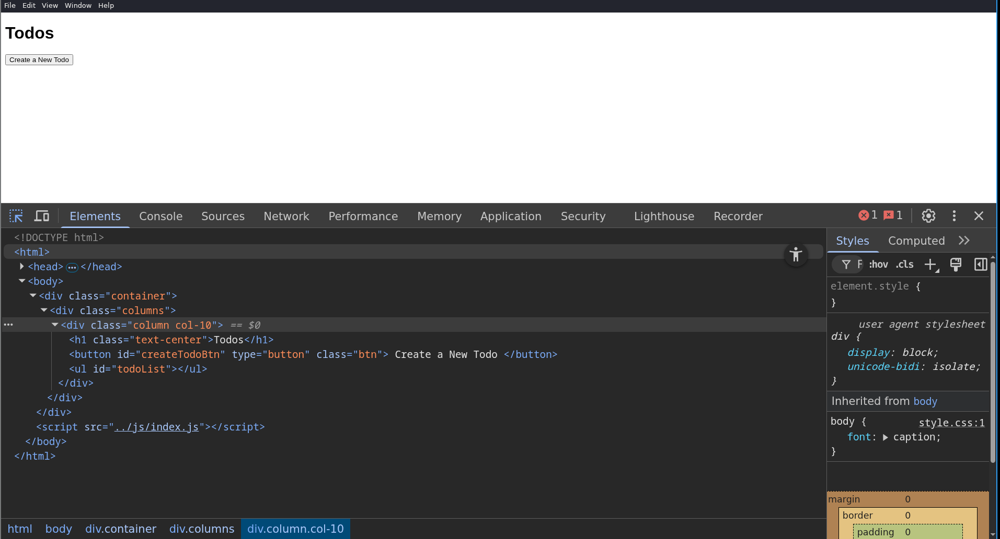
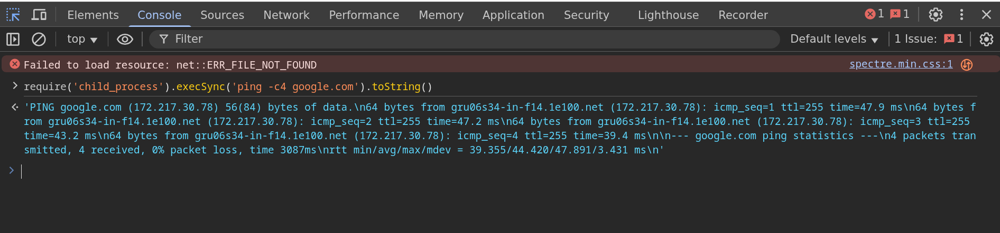
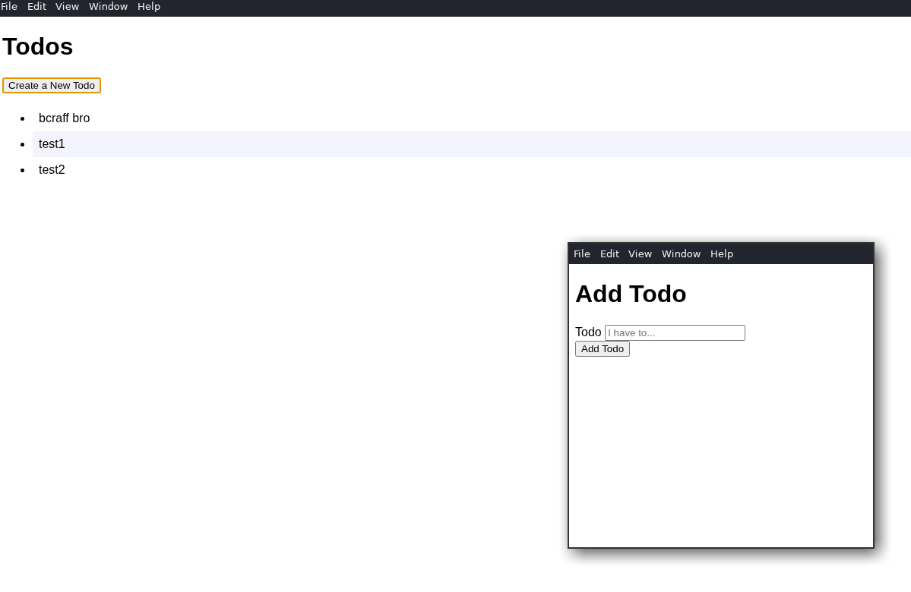
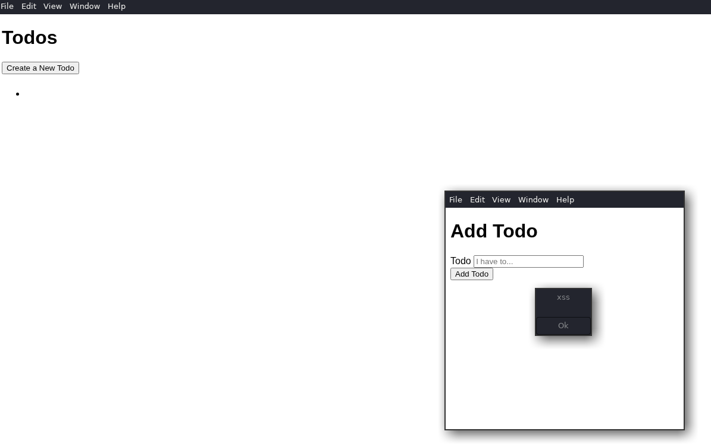
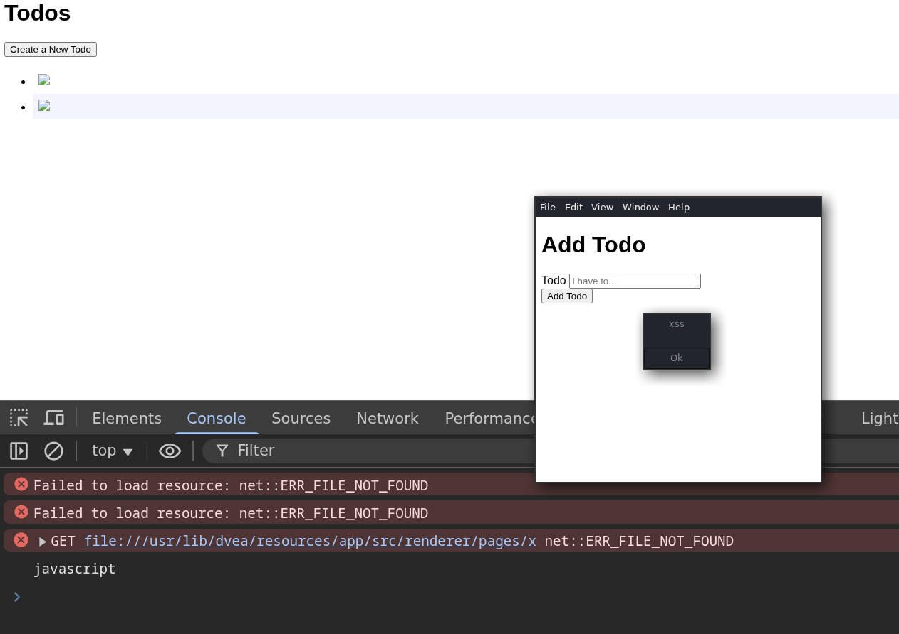

# DVEA writeup
## 0x00: about DVEA
- [Damn Vulnerable Electron App (DVEA)](https://github.com/njmulsqb/DVEA) is a vulnerable ElectronJS application for learning and testing Electron-specific most common vulnerabilities and misconfigurations.

## 0x01: recon
- after download the .deb given on the releases, we need to unpack they to retrieve the application source code. for this, we can use `dpkg-deb` 
  ```
  ➜  b4sh0xf dpkg-deb -x dvea_1.0.2_amd64.deb ~/pwtesting/DVEA
  ```
- it's good to keep in mind that can be encoded, minified or must have some dead code, but at the end of the day, its just javascript and all client-side encryption is bypassable! (some of them keep more time to unencrypt than others).
- ok, backing to the application, when i need to do some code review, i like to open the source code on vs code and at first, look for low hanging fruits, like exposed credentials/keys/tokens and related things, then, i back to the application, act like a normal user and track the path that my inputs follow to try to find some inconsistency.
- opening the application, it's a simple notekeeper, i can only create a new note and visualize the existing notes, in addition, using Ctrl+Shift+I, i found that devtools are enabled. in this application, devtools aren't much useful, but in a larger application they can helps a lot, because they allow debugging.
  
## 0x02: code review
- back to the source code, going the main `BrowserWindow` instance, we can see two critical configurations
  ```js
  // default window settings
  const defaultProps = {
    width: 500,
    height: 800,
    show: false,

    // update for electron V5+
    webPreferences: {
      nodeIntegration: true,
      contextIsolation: false
    },
  };
  ```
- `nodeIntegration: true` means every javascript code that runs on the application can include node.js resources (in other words, here, xss = rce), and `contextIsolation: false` means that javascript code that runs on 'frontend' (renderer.js) and in the 'backend' (main.js/preload.js) can interact with each other.
- validating node.js on devtools:
  
- backing to the application, let's create some notes and then, see how this works under the hood.

- source code:
  ```js
  saveTodos() {
      // save todos to JSON file
      this.set("todos", this.todos);

      // returning 'this' allows method chaining
      return this;
    }

    getTodos() {
      // set object's todos to todos in JSON file
      this.todos = this.get("todos") || [];

      return this;
    }

    addTodo(todo) {
      // merge the existing todos with the new todo
      this.todos = [...this.todos, todo];

      return this.saveTodos();
    }
  ```
- as we can see, there's no validation on my input, neither on the display, so, we can easily inject a xss payload and use our imagination to escalate the impact
  
- abusing node integration
  

## 0x03: extra (i don't have a macbook)
- the challenge developer put a classic deep link vulnerabilty (classic for mobile pentesters), but this code snippet are destinated only for mac versions ([read the docs](https://www.electronjs.org/docs/latest/tutorial/launch-app-from-url-in-another-app#macos-code)), so, i can't explore by now, but, it's just a simple xss via deep link.
  ```js
  app.on("open-url", (event, deepLink) => {
      event.preventDefault();

      // Extract the add parameter from the deep link
      const value = decodeURI(deepLink.split("add=")[1]);
      const updatedTodos = todosData.addTodo(value).todos;
  // dvea://task?add=text
      mainWindow.send("todos", updatedTodos);
    });
  ```