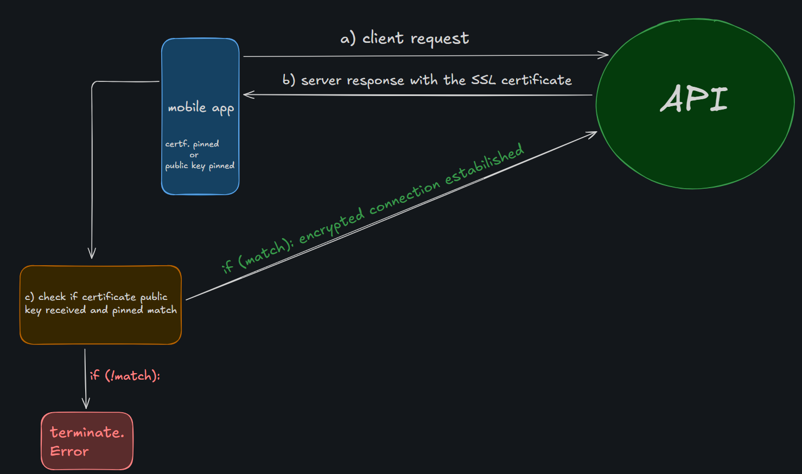
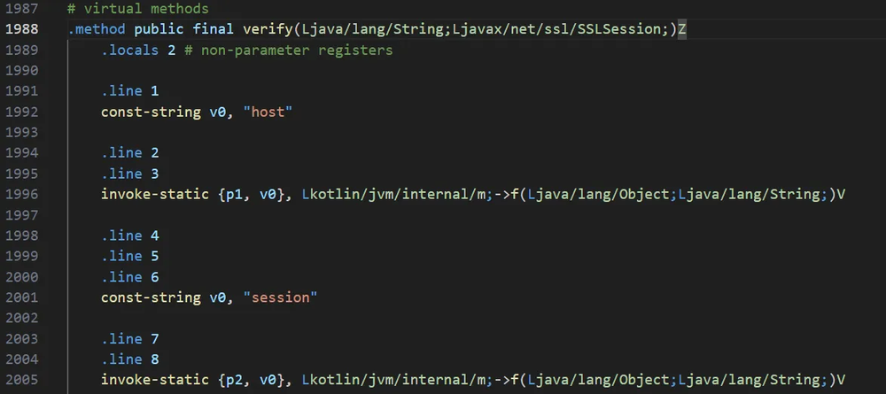
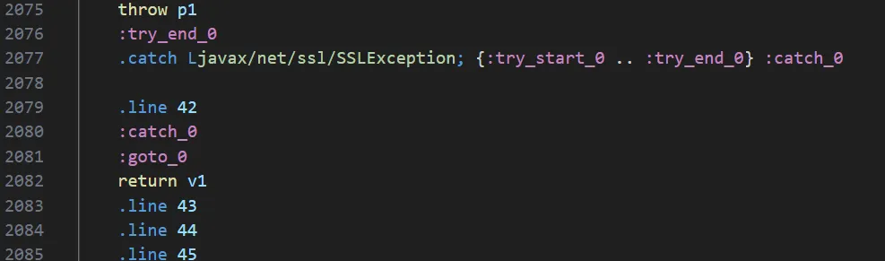
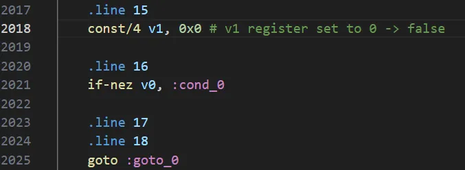
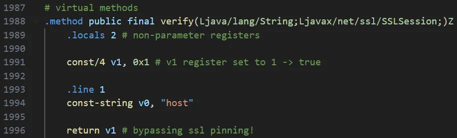

## 0x00: what is ssl pinning?
- ssl pinning or certificate pinning is a technique applied by mobile devs since the start of the last decade, with the mass use of HTTPS on websites and api's around the world. the goal of the ssl pinning is avoid the use of web proxies like burp suite or fiddler to perform MITM attacks and analyze the requests that the application are doing, allowing to attackers interact directly with the api, making the life of pentesters and red teamers more difficult. 
- made this simple introduction, lets understand how this really works. normally, ssl pinning is impemented by the embedding the server's certificate or an public key directly on the app. with this, some functions are implemented to verify if the certificate presented during the TLS handshake matches with the one pinned on app
- here is a simple visual scheme about how this works:

    

## 0x01: ssl pinning really matters?
- in a first-look, this technique appears to be so good, because "avoid" hackers to dynamically test mobile applications, but nowadays, ssl pinning its an "outdated" way to apply security mechanisms to your apps and it's just an illusion of protection. i'll give you some reasons to abandon certificate pinning. at first, remember that CA certificates may (and should) passes by renewals, revocations and migrations, so, when this occurs, the app is obligated to recieve an update, even without actual features changes or bug fixes, what can impact user experience and business operations. second, industry leaders like [google](https://developer.android.com/privacy-and-security/security-ssl) and [cloudflare](https://developers.cloudflare.com/ssl/reference/certificate-pinning/) are disencouraging devs to use this technique, under prerrogative that doesn't provide significant security benefits compared to alternative security mechanisms. at last, ssl pinning, normally, it's easy to bypass and i'll show you how in the next topics.

## 0x02: automated tools to perform bypass of ssl pinning
- there exists many ways to break the certificate pinning implemented on an android application. you can use public frida scripts like [Universal Android SSL Pinning Bypass](https://codeshare.frida.re/@pcipolloni/universal-android-ssl-pinning-bypass-with-frida/) or [Bypass SSL Pinning](https://codeshare.frida.re/@Q0120S/bypass-ssl-pinning/), [objection](https://github.com/sensepost/objection?source=post_page-----0b42a778b0f2---------------------------------------), [AlwaysTrustUserCerts](https://github.com/NVISOsecurity/AlwaysTrustUserCerts) magisk module [reflutter](https://github.com/Impact-I/reFlutter), for apps developed on flutter, etc. 
- i like to use [apklab](https://github.com/APKLab/APKLab), a add-on on vscode that contains many cool features to perform android pentesting. but, as any tool that you use, it's important to know what they do behind the scenes, so, before use this tools, we will learn how to bypass ssl pinning manually, decompiling the apk, recognizing how this protection are implemented and deactivate them. before we continue, i will talk a bit about smali, an assembly-like language that translate dex bytecode to an human-readable format, because the bypass involves modify the apk at smali level.

## 0x03: about smali
- smali is the assembly code of dex bytecode and its way more easier to understand than x86_64 assembly. here, we will work with registers too, they are used to store parameters and local variables. when i'm reversing smali code, i always check both this smali [cheatsheet](https://sallam.gitbook.io/sec-88/android-appsec/smali/smali-cheat-sheet?ref=blog.hackersonsteroids.org) and the [smali docs](https://pysmali.readthedocs.io/en/latest/api/smali/language.html).
- let's pratice and rebuild a smali code back to java.

    ```smali
    .method private swap([II)V
    # this is a private method, named sawp, that recieves a integer, an array and returns void

        .registers 5 
        # normally, the registers distribution it's something like this:
        #   - last n registers -> reserved to the n arguments
        #   - first n registers -> reserved to the n local variables 
        #   - one of the registers -> reserved to be an autorreference to the class (this)

        # v1 -> local
        # v0 -> local (a)
        # v2 -> this, pointers to the class
        # v3 -> int array[]
        # v4 -> int i
        
        aget v0, v3, v4          # load the value from index v4 into v0 => v0 = v3[v4]
        # int a = array[i] 
        
        add-int/lit8 v1, v4, 0x1 # v1 = v4 + 1
        # v1 = i + 1
        aget         v1, v3, v1  # v1 = v3[v1]
        # v1 = array[i + 1]
        aput         v1, v3, v4  # assign value v1 to array index v4 => v3[v4] = v1
        # array[i] = array [i + 1]
        
        add-int/lit8 v1, v4, 0x1 # v1 = v4 + 1
        # v1 = i + 1
        aput         v0, v3, v1  # v0 = v3[v1]
        # array[i + 1] = a = array[i]
        
        return-void
    .end method
    ```

- now, look your correspondent in java

    ```java
    private void swap(int array[], int i) {

            int a = array[i];
            
            array[i]     = array[i + 1];
            array[i + 1] = a;
            
    }
    ```

## 0x04: hands-on
- to apply what we have learned, let's built a simple app, implementing ssl pinning with [`HostnameVerifier#verify`](https://docs.oracle.com/javase/8/docs/api/javax/net/ssl/HostnameVerifier.html) method




