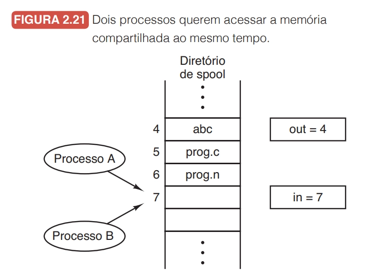
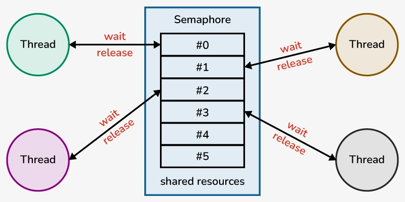
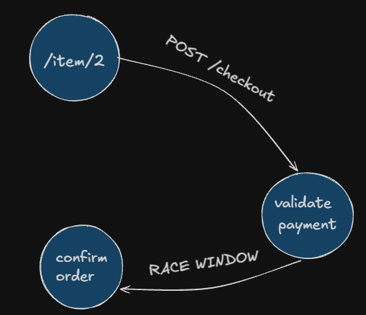
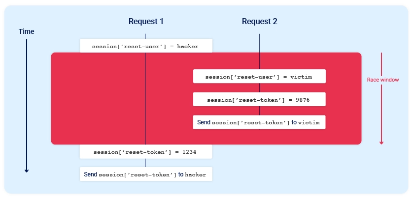
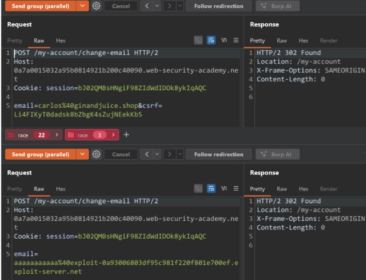

# **race condition**

## 0x00: introduction
### what is race condition?
- race condition is a vulnerability that can easily happen when multi-threading and/or concurrent features are implemented on a software. the root cause is when multiple coroutines or threads try to read or write data on the same memory region at the same time and the operation’s result depends on the order/time that the routines are executed, causing errors or an unintended behavior, so an attacker can leaverage this to exploit vulnerabilities (like business logic flaws, in a web applications context) and/or bypass security controls already implemented.
- the period of time that the threads/routines collide is known as race window, so the main focus of the techniques that exploit this vulnerability my be reach these window and abuse the unintended behaviour.
    
- another visual example to take the idea:
    
### why this vuln occurs?
- this vulnerability occurs because multitask systems, in general, as we already talked about, are strongly dependent on the order and the time that the operations are executed, so is atural to occurs collisions, desynchronizations, fails on the IPC (inter-process comunication) and in the scheduler. so if the developers dont apply an efficient method to prevent state collisions, there will be race windows.
- that can occur on logical circuits, daemons, web applications and in many other contexts that require or just implement concurrency/paralellism
    
- basically, race conditions occurs when we have simultaneous access on the space shared by the processes and it’s reinforced by the use of non-atomic operations, that is, operations that can be interrupted and shared by coroutines/threads (e.g. read-write), which can cause inconsistent states and collisions.
### what mecanisms and techniques are used to prevent this vuln?
- before start this topic, lets get a overview about atomic and non-atomic functions. an atomic function acting on shared space memory it’s an operation finishes on a single step, and none another thread or coroutine could access his data on-the-fly, for example, consider that we have a atomic function called loadFile(*file string) that works with an variable shared by another functions. none of these functions can access this variable until loadFile returns. by the logic, a non-atomic function it’s just the opposite of all that i’ve talked for. we wil recover these concepts later, now, let’s learn about mutexes and semaphores.
- both mutexes (mutual exclusion objects) and semaphores are synchronizing techniques, to avoid problems on state sharing by threads. a mutex locks an resource and turn it into a strict ownership object, only the thread that locks the shared resource can unlock, it guarantees that the object will only be accessed by only routine at time. its sounds good, but if the resource-owner thread takes too long to complete an operation, by any reason, it could happen an deadlock, starvation (low-priority task waits an eternity to be executed) or a priority-inversion (unexpected behavior as well as race condition!). 
    
- a semaphore its an `uint` shared by multiple threads and is responsible to sinalize what thread can access the shared resource on that time. using semaphores on big data systems can easily due to SPOF (single point of failure).
    
- it’s easy to implement mutexes and semaphores in golang, let’s see:
    ```go
    import (
        "sync"
        "semaphores"
    )

    // instantiating an MUTEX
    mutex := new(sync.Mutex)
    mutex.Lock()
    go ConcurrentOperation()
    mutex.Unlock()

    // instantiating an Semaphore
    sph := semaphore.NewWeighted(int32(5))
    sph.aquire(ctx, 1)
    go ConcurrentOperation()
    sph.release(1)
    ```

## 0x01: contexts where race condition can arise
### web applications
- as we known, the http protocol is stateless, it means the response that you got isn’t depends on any other previous requests (any other kind of behaviour that appears to be opposite to this it’s a feature implemented by web proxies, CDN’s and related tools). so, the web, is concorrent by design, and may be, because an webapp should be able to handle multiple requests at once and doesn’t affect the user experience.
- to avoid the necessity to vertically scale (real paralellism usage) an application, developers use concurrency tricks to manage multiple operations, but, as we known, its easy to make mistakes when it comes to concurrent programming. so, let’s analyze a vulnerable snippet.
    ```go
    **var validated bool

    func main() {
            http.HandleFunc("/ping", checkAddr)
            fmt.Printf("[*] running at http://localhost%s", port)
            http.ListenAndServe(port, nil)
    }

    func checkAddr(w http.ResponseWriter, r *http.Request) {
            addr := r.URL.Query().Get("addr")
            validated := sanitizeAddr(addr)
            
            if validated {
                exec.Command("ping -c2", addr) 
            } else {
                http.Error(w, "addr not allowed", http.StatusForbidden)
            }
    }

    func sanitizeAddr(addr string) bool {
            simpleIPv4Regex := `^\d{1,3}(\.\d{1,3}){3}$`
            return regexp.MustCompile(simpleIPv4Regex).MatchString(addr)
    }
    ```
- if you use the default package for ping this ip addresses, know that each new request to ping an given ip, starts a new goroutine, in addition, global variables have his state shared by all the functions on the program, so, we can have multiple goroutines chaning the value on the same memory region, because is the same variable. in other words, by exploiting an race condition, we can easily bypass the regex and trigger an RCE!
### linux kernel
- coming soon
## 0x02: exploitation
### limit overrun
- limit overrun its an subcategory on classical TOCTOU (time-of-check-time-of-use), it consists on exploit the temporary substates between two operations. to validate this vuln, we can look for a single use or rate limited endpoint (dont forget the impact on the application!) and send multiple paralell requests. let’s solve the lab, we have a simple ecommerce with an promotional code that can be applied only once, so, before apply, we can intercept our request, send to repeater and group some requests to send in paralell using the last byte sync technique (love u james kettle)
    ```
    POST /cart/coupon HTTP/2
    Host: 0a24004f03787e8980b80d4a00170095.web-security-academy.net
    Cookie: session=8MzzQt49QtGoXQCrWlchsNdY1QvUXfd1
    Content-Length: 52
    Content-Type: application/x-www-form-urlencoded
    Origin: https://0a24004f03787e8980b80d4a00170095.web-security-academy.net
    Accept: text/html
    Referer: https://0a24004f03787e8980b80d4a00170095.web-security-academy.net/cart

    csrf=SXBgCVVnzVMVc7hHcx9QAEeEucOue7ad&coupon=PROMO20**
    ```
- in this another lab, we can bypass the rate limit using limit overrun and turbo intruder
    ```python
    def queueRequests(target, wordlists):

        engine = RequestEngine(endpoint=target.endpoint,
                            concurrentConnections=1,
                            engine=Engine.BURP2
                            )
        
        # assign the list of candidate passwords from your clipboard
        passwords = wordlists.clipboard
        
        # queue a login request using each password from the wordlist
        for password in passwords:
            engine.queue(target.req, password, gate='1')
        
        # once every request has been queued
        engine.openGate('1')

    def handleResponse(req, interesting):
        table.add(req)
    ```
### multi-endpoint race conditions
- let this state machine for a ecommerce web application

- we can try abuse the race window between the order confirmation and payment validation we add more items to our cart, and dont pay for them. there are some security mechanisms to avoid this kind of trick, like deliberate delays on the infrastructure, but its important to keep in mind that back-end connection delays don't usually interfere with race condition attacks because they typically delay parallel requests equally, so the requests stay in sync. 
- we need to be able to distinguish different kinds of delay and, before send the paralell requests to trigger race contidion, we can add inoffensive requests, like a GET to /home. in the lab, the flow of purchase is: POST /cart → POST /cart/checkout, after sending sequential requests (over the same connection), we can see that put a GET request to /home decrease the response time, so, its fair to asume that we can try a race condition involving these 3 requests in paralell.
    ```
    (product that we cant pay for)
    POST /cart HTTP/2
    Host: 0ae1002704867499801cc1a100b60044.web-security-academy.net
    Cookie: session=SGo2hJ0SHMZnbR82jYUjglJW2N7X0oLB
    Content-Length: 36

    productId=1&redir=PRODUCT&quantity=1

    (cart already have a product that we can pay for)
    POST /cart/checkout HTTP/2
    Host: 0ae1002704867499801cc1a100b60044.web-security-academy.net
    Cookie: session=SGo2hJ0SHMZnbR82jYUjglJW2N7X0oLB
    Content-Length: 37

    csrf=E0yhhHAn4gbmPB6rbOlOJrPtYmxgiS9x

    GET / HTTP/2
    Host: 0ae1002704867499801cc1a100b60044.web-security-academy.net
    Cookie: session=SGo2hJ0SHMZnbR82jYUjglJW2N7X0oLB
    ```
### single-endpoint race conditions
- it happens when you can overwrite the data that arrives to a given endpoint by sending two paralell requests with different data, in the first request, data that you doesnt want to arrive, but applications wants and in the second, data that you want to arrive, but application blocks or simply “doesnt render”
    
- in the lab, we have a mechanism to change email, but you need a token to verify and finish the change, and only emails from a specific domain are eligible, so, we can send two parallel requests, one of them have an third party email (0-click ATO)
    
### code review: a golang graphql api (hacking club ctf)
- let's analyze the main source code
    ```go
    var failed error

    func main() {
        data, err := os.ReadFile("products.json")
        if err != nil {
            log.Fatalf("Failed to read products: %v", err)
        }

        err = json.Unmarshal(data, &products)
        if err != nil {
            log.Fatalf("Error loading products: %v", err)
        }

        fileType = graphql.NewObject(graphql.ObjectConfig{
            Name: "File",
            Fields: graphql.Fields{
                "name": &graphql.Field{
                    Type:        graphql.String,
                    Description: "File name",
                },
                "path": &graphql.Field{
                    Type:        graphql.String,
                    Description: "File path",
                },
                "size": &graphql.Field{
                    Type:        graphql.Int,
                    Description: "File size in bytes",
                },
                "isDir": &graphql.Field{
                    Type:        graphql.Boolean,
                    Description: "Indicates if it's a directory",
                },
                "content": &graphql.Field{
                    Type:        graphql.String,
                    Description: "File content (only for text files)",
                },
            },
        })

        productType = graphql.NewObject(graphql.ObjectConfig{
            Name: "Product",
            Fields: graphql.Fields{
                "id": &graphql.Field{Type: graphql.String},
                "name": &graphql.Field{Type: graphql.String},
                "description": &graphql.Field{Type: graphql.String},
                "price": &graphql.Field{Type: graphql.Float},
                "imageIcon": &graphql.Field{Type: graphql.String},
                "characteristics": &graphql.Field{
                    Type: graphql.NewList(graphql.String),
                },
            },
        })

        fields := graphql.Fields{
            "product": &graphql.Field{
                Type: productType,
                Args: graphql.FieldConfigArgument{
                    "id": &graphql.ArgumentConfig{Type: graphql.String},
                },
                Resolve: func(p graphql.ResolveParams) (interface{}, error) {
                    idQuery, isOK := p.Args["id"].(string)
                    if !isOK {
                        err = fmt.Errorf("invalid product ID format")
                        return nil, err
                    }

                    for _, product := range products {
                        if product.ID == idQuery {
                            return product, nil
                        }
                    }

                    err = fmt.Errorf("product not found")
                    return nil, nil
                },
            },

            "products": &graphql.Field{
                Type: graphql.NewList(productType),
                Resolve: func(p graphql.ResolveParams) (interface{}, error) {
                    return products, nil
                },
            },

            "file": &graphql.Field{
                Type:        fileType,
                Description: "Read a specific file",
                Args: graphql.FieldConfigArgument{
                    "path": &graphql.ArgumentConfig{
                        Type:        graphql.NewNonNull(graphql.String),
                        Description: "Path of file to read",
                    },
                },
                Resolve: func(p graphql.ResolveParams) (interface{}, error) {
                    path := p.Args["path"].(string)

                    matched, _ := regexp.MatchString(`^[a-zA-Z0-9]*(\.[a-zA-Z0-9]*)?$`, path)
                    if !matched {
                        failed = fmt.Errorf("invalid or potentially dangerous path")
                    } else {
                        failed = nil
                    }

                    for i := 1; i <= 10; i++ {
                        time.Sleep(500 * time.Millisecond)
                    }

                    if failed != nil {
                        return nil, failed
                    }

                    info, err := os.Stat(path)
                    if err != nil {
                        return nil, err
                    }

                    file := File{
                        Name:  info.Name(),
                        Path:  path,
                        Size:  int(info.Size()),
                        IsDir: info.IsDir(),
                    }

                    if !info.IsDir() {
                        data, err := os.ReadFile(path)
                        if err == nil {
                            file.Content = string(data)
                        }
                    }

                    return file, nil
                },
            },
        }
        // redacted
        http.Handle("/graphql", corsMiddleware(h))

        http.HandleFunc("/health", func(w http.ResponseWriter, r *http.Request) {
            w.Header().Set("Content-Type", "application/json")
            io.WriteString(w, `{"status": "ok"}`)
            failed = nil
        })
    }
    ```

### code review: easy challenge from hxp 38c3 ctf
- let's go right to the vulnerable snippet on the application
    ```go
    func checkPath(path string) error {
        if strings.Contains(path, ".") {
            return fmt.Errorf("🛑 nielegalne (hacking)")
        }

        if strings.Contains(path, "flag") {
            return fmt.Errorf("🛑 nielegalne (just to be sure)")
        }

        return nil
    }

    func main() {
        time.AfterFunc(180*time.Second, func() {
            os.Exit(0)
        })

        session, ok := os.LookupEnv("SESSION")
        if !ok {
            panic("SESSION env not set")
        }

        dataDir := "/tmp/kv." + session
        err := os.Mkdir(dataDir, 0o777)
        if err != nil {
            panic(err)
        }
        err = os.Chdir(dataDir)
        if err != nil {
            panic(err)
        }

        http.HandleFunc("/get", func(w http.ResponseWriter, r *http.Request) {
            name := r.URL.Query().Get("name")
            if err = checkPath(name); err != nil {
                http.Error(w, "checkPath :(", http.StatusInternalServerError)
                return
            }

            file, err := os.Open(name)
            if err != nil {
                http.Error(w, "Open :(", http.StatusInternalServerError)
                return
            }

            data, err := io.ReadAll(io.LimitReader(file, 1024))
            if err != nil {
                http.Error(w, "ReadAll :(", http.StatusInternalServerError)
                return
            }

            w.Write(data)
        })
    ```

## 0x03: refs
### talks/articles
### blogposts
### labs