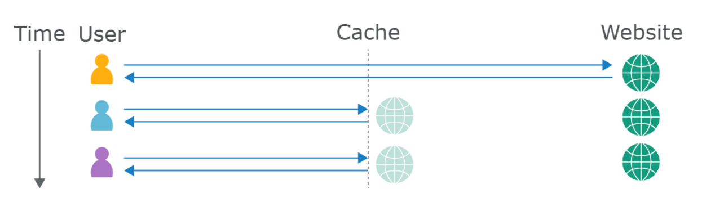
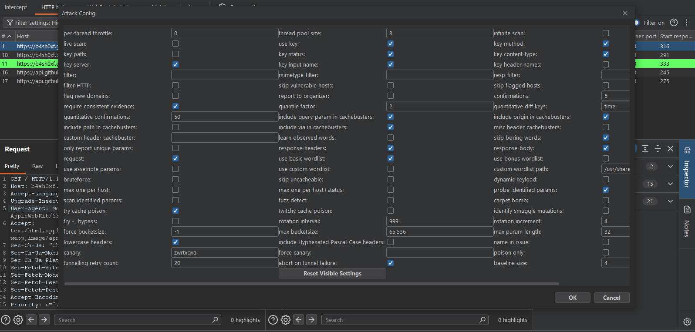
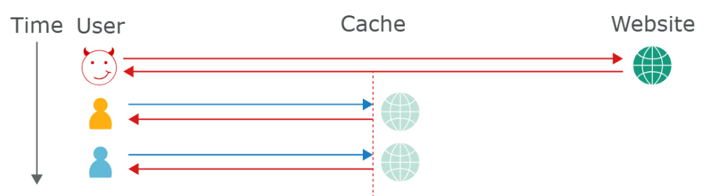
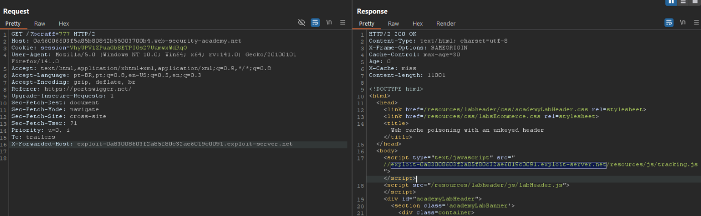

# 0x00: introdução

## referência:
- todo o conteúdo desse post é fundamento pelo conteúdo da portswigger e também pela talk do james kettle na EkoParty de 2018 sobre este assunto.
- [https://portswigger.net/web-security/web-cache-poisoning]
- [https://www.youtube.com/watch?v=jg1Yc2dJuaY]

## o que é o web cache poisoning?
- web cache poisoning é uma técnica que permite ao atacante explorar o comportamento de um web server, de modo a armazenar uma response maliciosa no cache, que por sua vez será enviada para outros usuários
- essa técnica é dividida em duas etapas: primeiro, o atacante deve fazer com que o servidor envie uma reponse contendo uma payload maliciosa, feito isso, ele deve se certificar de que ela fora armazenada em cache e subsequentemente será enviada para as vitimas
- uma vez atacado, o web cache pode explorar vulns como: `xss`, `js injection`, `open redirect`, etc.

# 0x01: aprofundamento

## como o web cache funciona?
- se um servidor respondesse literalmente à todas as requests http que lhe são enviadas (o que pode chegr a milhares simultaneamente, a depender da ocasião), isso ocasionaria em graves problemas de latencia e uma experiencia horrivel pro usuário. para isso não acontecer, existe o sistema de caching, que armazena as responses para requests específicas, então, quando um outro usuário faz uma request equivalente, o cache simplesmente copia o que já está salvo e retorna para o cliente, sem nenhuma interação com o back-end
    
- quando o cache recebe uma request http, ele primeiro tem que verificar se existe alguma response já pronta que ele possa utilizar, se não, ele a encaminha para o back-end. essa verificação é feita a partir das cache keys, que geralmente contêm a uri da request e o header Host. os componentes de uma request que não fazem parte da cache key são chamadas de unkeyed

## impacto
- o impacto desse tipo de ataque é extremamente dependente desses 2 fatores:
    - o que exatamente o atacante consegue fazer o cache armazenar
    - a quantidade de tráfego que a aplicação vulnerável recebe
- geralmente, o web cache poisoning é utilizado como uma forma de viabilizar outras vulnerabilidades. note que o ataque não depende do lifetime do cache, visto que o ataque pode ser configurado para se auto-replicar

# 0x02: construindo o ataque

## passos
- identificar e avaliar `unkeyed` inputs
- provocar uma resposta maliciosa vinda do back-end
- pegar a response vinda do cache

## `unkeyed` inputs
- qualquer ataque de web cache poisoning depende da manipulação desse tipo de input, além de headers. como já fora visto, o web cache ignora os unkeyed inputs na hora de decidir se a resposta será vinda do cache ou não. para detectá-los, podemos utilizar o add-on do burp [Param Miner](https://portswigger.net/bappstore/17d2949a985c4b7ca092728dba871943)
    

## harmful responses
- uma vez que você descobriu um unkeyed input, o proximo passo é avaliar de que forma o servidor o trabalha, para assim fazer o poisoning. se um input é refletido na resposta do servidor sem ser devidamente sanitizado, ou é usado para gerar dados dinamicamente, ele pode ser um bom entrypoint para o nosso ataque

## cache poisoning
- manipular inputs de forma maliciosa é apenas metade do caminho. para uma resposta ser armazenada em cache, depende de vários fatores, como extensões de arquivo, content-type, rotas, status code, etc. é necessário ter um conhecimento amplo sobre como o servidor trabalha as requests e como o cache se comporta
    

# 0x03: poisoning

## web cache poisoning -> xss
- vamos tomar como exemplo, a seguinte request:
    ```js
    GET /en?region=uk HTTP/1.1
    Host: innocent-website.com
    X-Forwarded-Host: innocent-website.co.uk
    ```
- seja o header em destaque um `unkeyed` input, agora, vejamos sua response
    ```js
    HTTP/1.1 200 OK
    Cache-Control: public
    <meta property="og:image" content="https://innocent-website.co.uk/cms/social.png" />
    ```
- veja que o valor do input está sendo utilizado para a geração de conteúdo dinâmico, no caso, para carregar uma imagem. vamos à prática.
- com o param miner, descobrimos que um dos `unkeyed` input é o header `X-Forwarded-Host`, e que ele é refletido dinamicamente na página.
    
- note que fizemos a request utilizando um parâmetro, para evitar que usuários reais sejam afetados.
- configurando o exploit server de acordo com a response:
- triggando o alert:

## `unkeyed` cookie
- fazendo uma request para a raiz do site, note que o valor do cookie fehost é armazenado em um array dentro de um código javascript
- modificando o valor desse cookie, notamos que ele fica armazenado no cache (X-Cache: hit)
- sabendo disso, podemos injetar uma payload para fazer o delievery de um xss stored
- PoC:

## web cache poisoning via multiple headers
- algumas aplicações vulneráveis a wcp requerem de nós a habilidade de craftar requests que explorem multiplos unkeyed inputs, por exemplo, considere uma aplicação que, ao receber uma request via protocolo HTTP, automaticamente gera um redirect para si mesmo, só que usando protocolo HTTPS (isso é bastante comum)
    ```js
    GET /passelongo HTTP/1.1
    Host: ghu.com
    X-Forwarded-Proto: http
    
    HTTP/1.1 301 moved permanently
    Location: https://ghu.com/passelongo
    ```
- por si mesmo, esse comportamento não é vulnerável, entretanto, podemos combinar isso com vulnerabilidades na geração dinamica de url’s, com isso, podemos explorar esse comportamento de tal forma a gerar uma resposta cacheável que redireciona os usuários para um servidor de nosso controle (usando outros headers). vamos à prática.
- analisando uma simples request para a raiz do site, em uma primeira olhada, nada parece saltar os olhos
- podemos forçar uma comunicação pelo protocolo HTTP com o header X-Forwarded-Proto e ver oq acontece
- mesmo a aplicação usando HTTPS, ela não reclama ao usarmos o header. agora, vamos remover esse header e e usar o X-Forwarded-Host, para forçamos uma request, por exemplo, para um servidor que controlamos (no caso, o exploit server)
- aparentemente, nada acontece. e se tentássemos combinar esses headers?
- também nada. ok, podemos trocar o X-Forwarded-Proto por [X-Forwarded-Scheme](https://github.com/rack/rack/issues/1809)
- ao fazermos isso, note que o response header Location nos leva para o nosso exploit server. verificando o log, vemos que realmente foi feita uma request para la
- agora, precisamos guardar no cache uma request para um arquivo javascript malicioso. para isso, basta localizar algum script carregado na página e configurar no nosso exploit server para que ele contenha o contéudo alert(document.cookie). feito isso, precisamos fazer uma request para esse arquivo, passando um cache buster*
- agora, para triggar, basta remover o cb e acessar o site normalmente. notaremos que conseguimos envenenar o cache e triggar um xss stored
- feito isso, triggamos!. este header foi cacheado: Location: https://exploit-0a7f00a204b4898c80e4f333018e0021.exploit-server.net/resources/js/tracking.js

## web cache poisoning via unknown header
- o maior desafio na exploração de um web cache poisoning é garantir que a request maliciosa seja cacheada. isso requer uma análise do funcionamento do sistema de cache, que pode ser facilitada de acordo com as responses da aplicação, como exemplo, o quão antigo o cache é e quando ele é limpo. isso nos ajuda a estressar menos a aplicação e causar menos suspeita
    ```js
    HTTP/1.1 200 OK
    Via: 1.1 varnish-v4
    Age: 174
    Cache-Control: public, max-age=1800
    ```
- o header Vary pode ser de grande ajuda pra nós, pois ele especifica uma lista de headers adicionais que devem ser tratados como parte da cache key ainda que eles sejam normalmente unkeyed. ele é comumente usado pra especificar que o **`User-Agent`** é um header keyed, por exemplo, se a versão mobile de um site é cacheada, ela não deve ser exposta para usuários não-mobile.
- essa informação pode ser usada para construir um ataque para cujo alvos são um subconjunto de usuários, por exemplo, se nós sabemos que o **`User-Agent`** faz parte da cache-key, podemos craftar uma request para afetar todos os usuários que tenham esse header. vamos à prática
- fazendo uma request para a raiz da aplicação, vemos que ela responde com o header [`Vary: User-Agent`](https://developer.mozilla.org/pt-BR/docs/Web/HTTP/Reference/Headers/Vary)
- isso quer dizer que o header User-Agent é usado para determinar se a resposta virá do cache ou não, ou seja, se um usuario com o User-Agent igual a okhttp/3.0 fizer uma request para /assets/images/test.png e a response será armazenada em cache, apenas usuários com esse mesmo User-Agent poderão receber a response vinda do cache.
- utilizando o param miner, descobrimos que o header X-Host é unkeyed, então, podemos usá-lo e avaliar o seu comportamento e decidir se ele pode ser usado para explorar uma vulnerabilidade de web cache poisoning
- observamos que ele é refletido diretamente na aplicação, chamando um script js
- com isso, podemos configurar nosso exploit server para fazer o delivery de um xss stored. no entanto, precisamos alcançar a vitima e pra isso precisamos descobrir o seu User-Agent. para isso, podemos ir na seção de comentários, e abusar de um html injection para redirecionar a vitima para o nosso exploit server.
- feito isso, basta repetir o processo de poisoning, mas agora com o user-agent da vitima
- pwned!

## web cache poisoning -> dom xss
- - como sabemos, se a aplicação utiliza-se de valores de unkeyed headers para importar arquivos, principalmente js ou json, provavlemente é possivel realizar a exploração de um web cache poisoning.
- além disso, também sabemos que se aplicações usam javascript para fazer fetch de recursos vindos do back-end. se forem tratados de maneira incorreta, isso pode acarretar em vulnerabilidades DOM-based. por exemplo, considere que a aplicação importe um JSON semelhante a esse:
    
    ```json
    {
    		"language":"en-US"
    }
    ```
    
- se de alguma maneira um atacante conseguir manipular o conteudo desse json, e este por sua vez for passado como argumento para alguns tipos de funções, podemos triggar algumas vulns. nota: se você está servindo um json malicioso para uma exploração de web cache poisoning, para que este seja carregado, é necessário configurar o CORS dessa maneira: **`Access-Control-Allow-Origin: *`**, ou seja, permitir que requests com uma Origin arbitrária possma carregar o seu conteúdo. vamos a prática:
- logo de cara, vemos um certo delay no carregamento no site, dando uma olhada nas requests, vemos uma que demora consideravelmente para devolver uma response. a request para /resources/json/geolocate.json carrega o seguinte json:
    
    ```json
    {
        "country": "United Kingdom"
    }
    ```
    
- voltando pro site, vemos que esse conteudo reflete diretamente no front-end
- inspecionado o elemento, não há nada incomum, mas podemos fazer a análise do código de geolocate.js 
- **`geolocate.js`**
    ```js
    function initGeoLocate(jsonUrl)
    {
        fetch(jsonUrl)
            .then(r => r.json())
            .then(j => {
                let geoLocateContent = document.getElementById('shipping-info');
    
                let img = document.createElement("img");
                img.setAttribute("src", "/resources/images/localShipping.svg");
                geoLocateContent.appendChild(img)
    
                let div = document.createElement("div");
                div.innerHTML = 'Free shipping to ' + j.country;
                geoLocateContent.appendChild(div)
            });
    }
    ```
- aqui está a lógica de carregamento da imagem e do local da entrega. a função **`initGeoLocate()`** recebe uma url e faz um fetch. daí, é criada uma tag **``** cujo source é **`${jsonUrl}/resources/images/localShipping.svg`**. além disso, uma div é criada e a propriedade country de um json é inserida dentro do DOM dessa div.
- ok, agora precisamos ver onde essa função é chamada e com quais argumentos. rapidamente encontramos sua chamada em **`index.js`**: **`initGeoLocate('//' + data.host + '/resources/json/geolocate.json');`**
- agora precisamos saber o que seria esse data.host. ainda em index.js, encontramos um json chamado data com duas propriedades: host e path: **`data = {"host":"0a6900be0345e1a880c703cd00ee0016.web-security-academy.net","path":"/"}`**.
- notamos que o host nada mais é que o hostname do desafio. então basicamente entendemos o motivo da demora do carregamento total do site. uma request é feita (sem await) pra **`0a6900be0345e1a880c703cd00ee0016.web-security-academy.net/resources/json/geolocate.json`**. daí, é carregada a imagem localizada em **`0a6900be0345e1a880c703cd00ee0016.web-security-academy.net/resources/images/localShipping.svg`**. por fim, a propriedade country do json que vimos inicialmente é carregada para dentro do DOM de uma div.
- com isso em mente, se conseguirmos manipular esse host para um servidor que controlamos, podemos explorar um DOM-based XSS facilmente. podemos fazer isso usando web cache poisoning, mas antes temos que descobrir algum unkeyed input que nos seja útil, no caso, um que nos permita alterar a propridade host do json data. vamos ao param miner:
- vamos validar o header X-Forwarded-Host 
- note que o seu valor foi refletido dentro do json que nos interessa e a request foi armazenada em cache e agora o host é o do nosso exploit server, então, vamos configurá-lo para requests feitas para ele na rota /resources/json/geolocate.json respondam com um json malicioso
- pwned!

## chaining web cache poisoning vulnerabilities