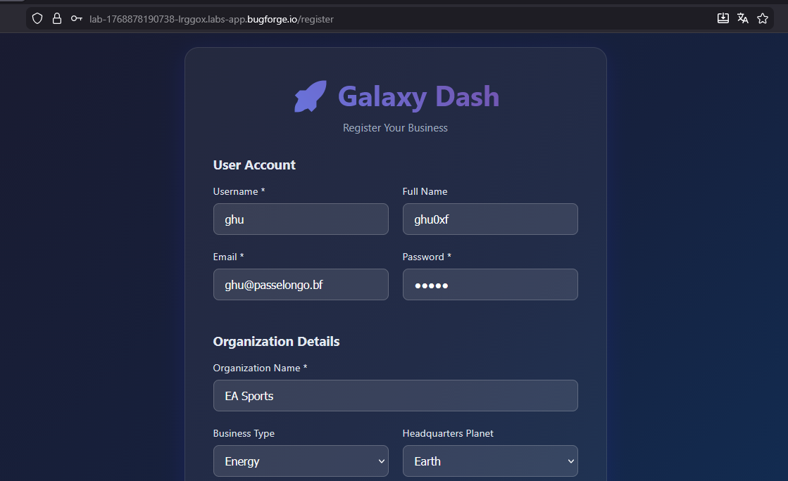
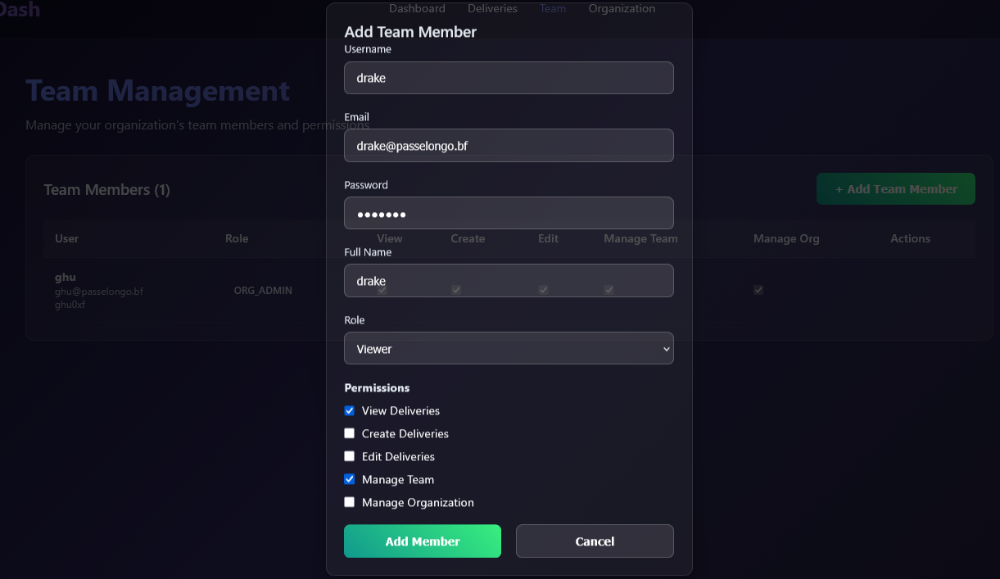
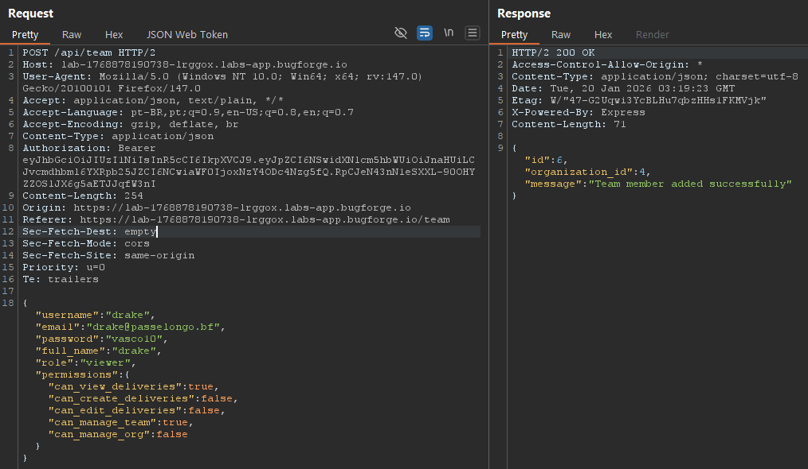
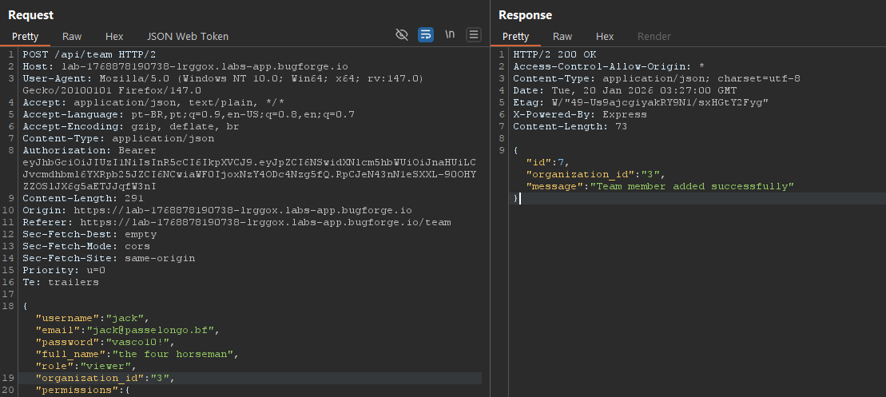
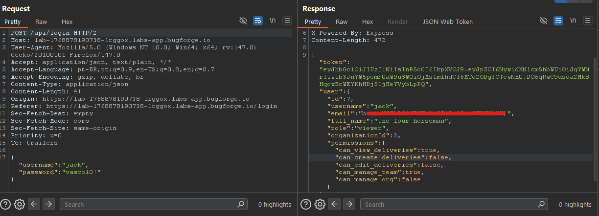

<h2><b>weekly challenge: 17/01/26 - 24/01/26</h2>
    <ul style="list-style: none; padding: 0; margin: 0; font-size: 1.2em; color: #8b949e;">
        <li>🟡 <b>difficulty:</b> medium</li>
        <li>⚡ <b>xp earned:</b> 50</li>
        <li>📂 <b>categories:</b> <code>api</code>
        <li>🛠️ <b>vulns:</b> <code>broken object property authorization</code>
    </ul>

## 0x00: recon
- to start our analysis, we can create our organization

    

- there's so many features to see, and so many endpoints to analyze, so, i will make a `jmp` to the vulnerable feature: the team management

## 0x02: fuzzing
- let's add a new member to our organization

    

- intercepting the request with burp, there's a json with some entries and the response contains the id of the new user and our organization id

    

- when we testing api's, the first things that i analyze is if it's possible modify user's (mine and others) properties that, in principle, it could'nt be writable. in this case, note that `organization_id` property isn't in the request body, so, it will be possible to edit and add a user to another team?

    

- we added a user to organization with id 3

## 0x03: show me the flag
- when we log in with those credentials, we take the flag!

    