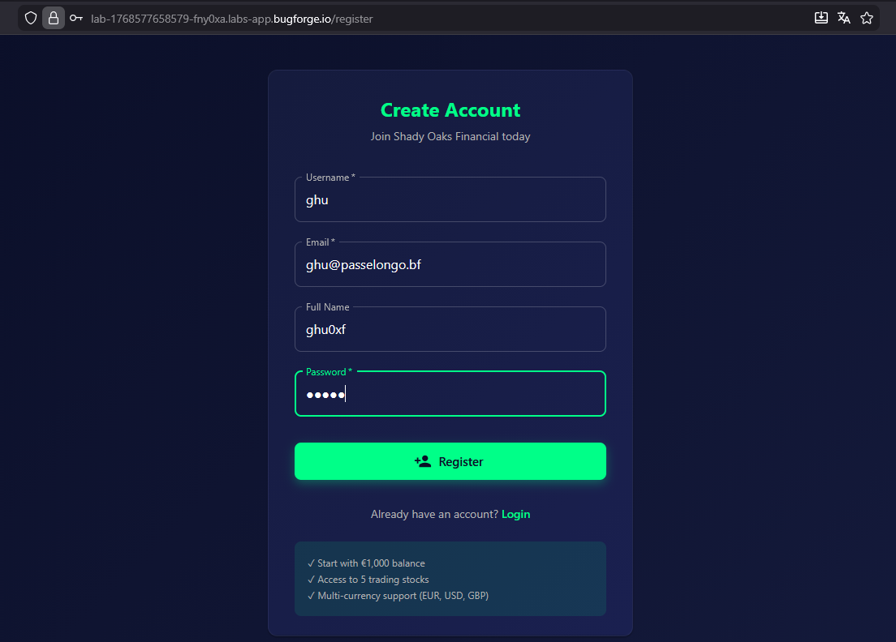
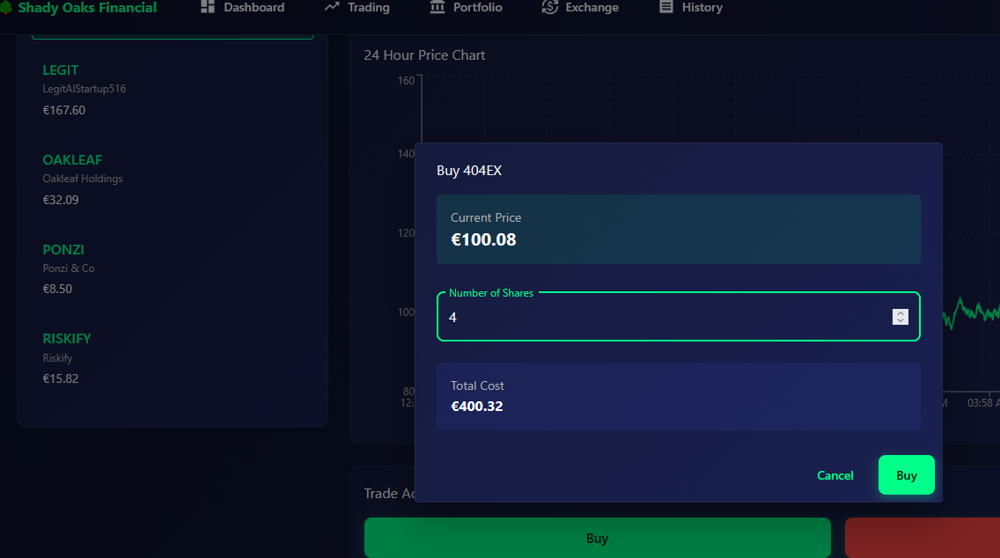
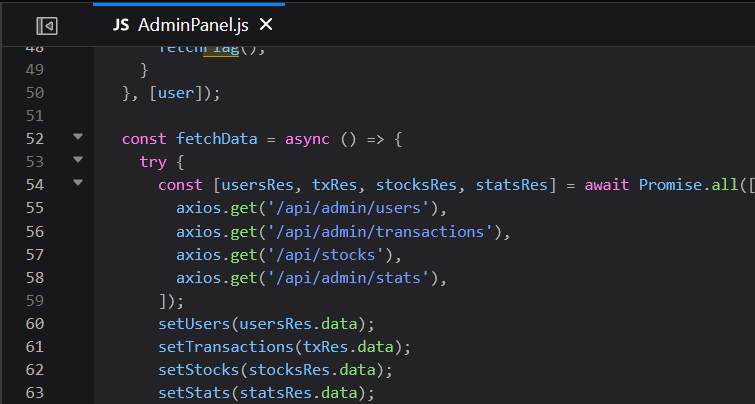
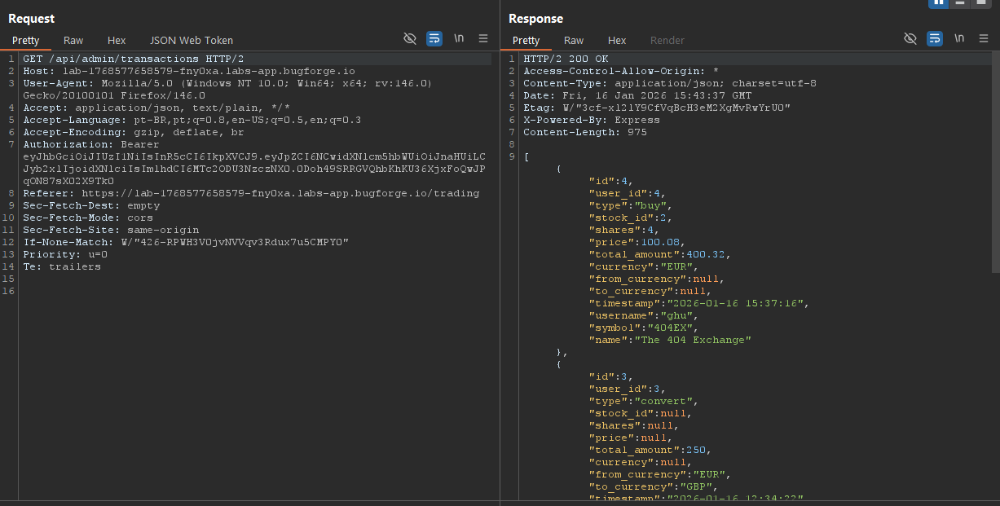
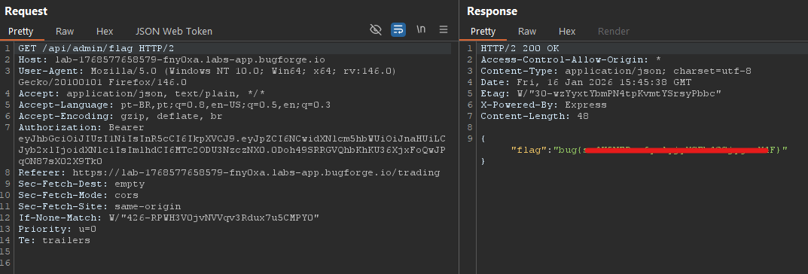

<h2><b>daily challenge: 16/01/26</h2>
    <ul style="list-style: none; padding: 0; margin: 0; font-size: 1.2em; color: #8b949e;">
        <li>🟢 <b>difficulty:</b> easy</li>
        <li>⚡ <b>xp earned:</b> 10</li>
        <li>📂 <b>categories:</b> <code>api</code>
        <li>🛠️ <b>vulns:</b> <code>broken function level authorization (bfla)</code>
    </ul>

## 0x00: recon
- we can start registering our user to this trading webapp

    

- our account starts with 1k euros (i wish that isn't a ctf.) and we can buy/sell digital stocks, exchange money between currencies and all our actions are registered.

    

## 0x01: show me the flag!
- after testing some business logic vulns, we can perform a code review in the `.js` files

    

- when we try to access these admin routes, for my surprise, all of them works! this is an broken function level authorization, when a common user can perform high-privillege actions in the application. in this case, a common trader can see all the trades ever made.

    

- continuing our code review, we can see there exists an `/api/admin/flag` endpoint and by the logic (the vuln, lol), we can take the flag.

    