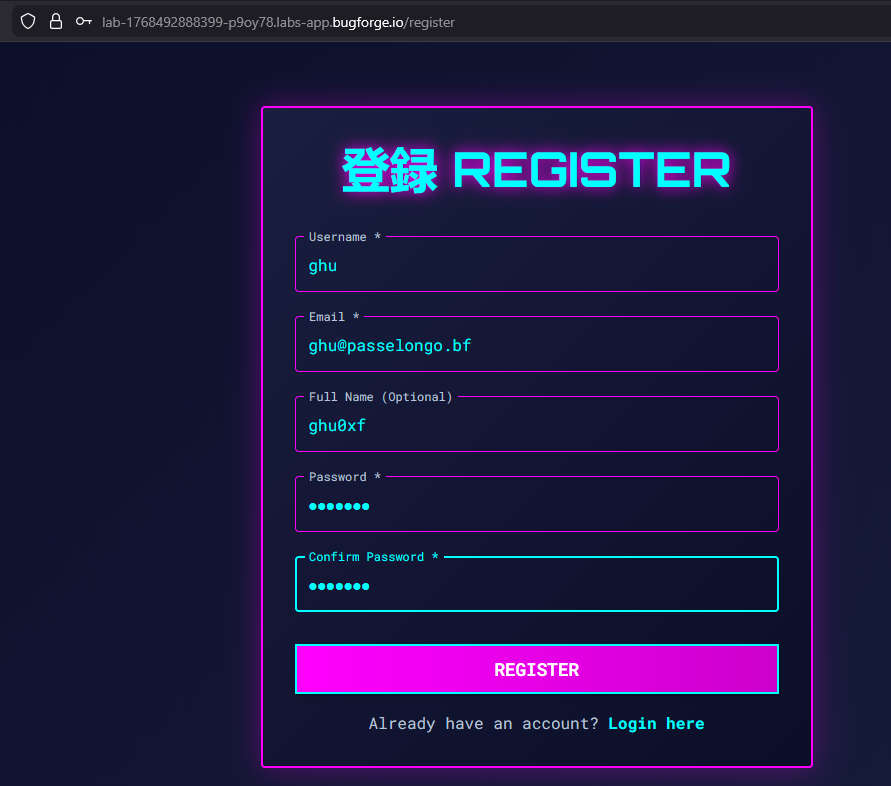
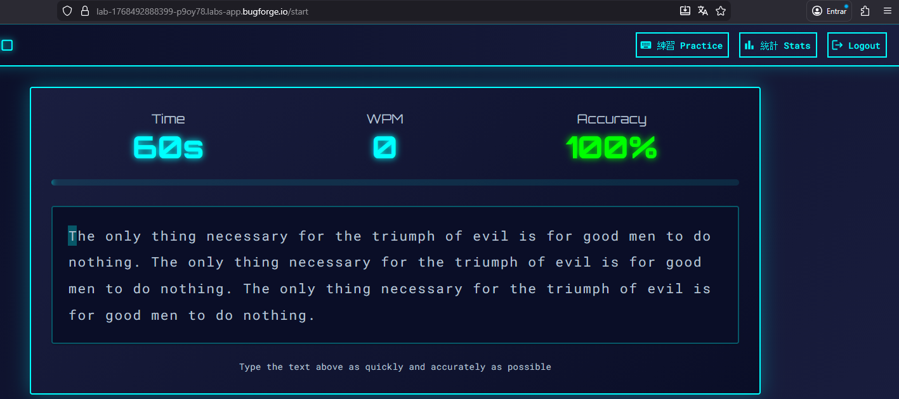
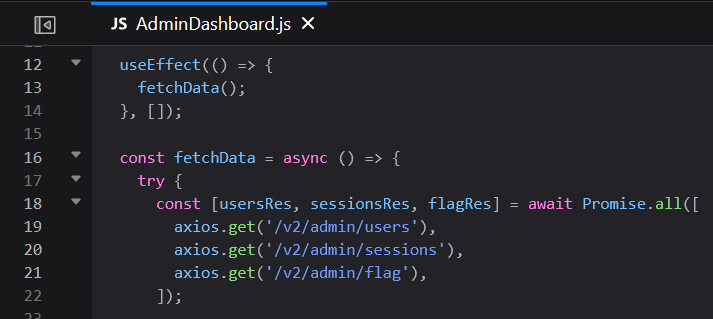
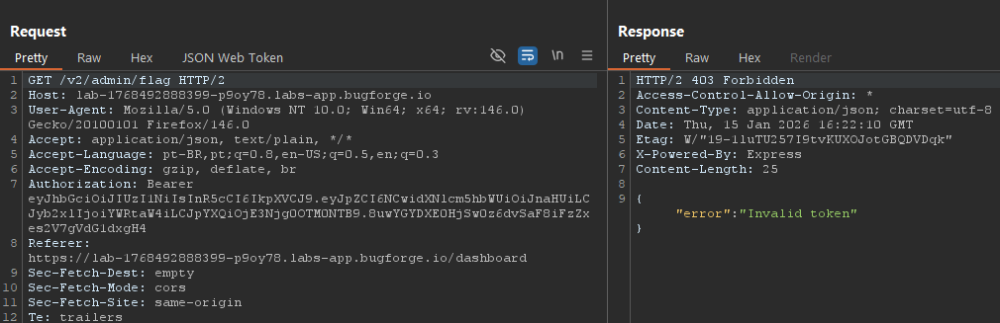
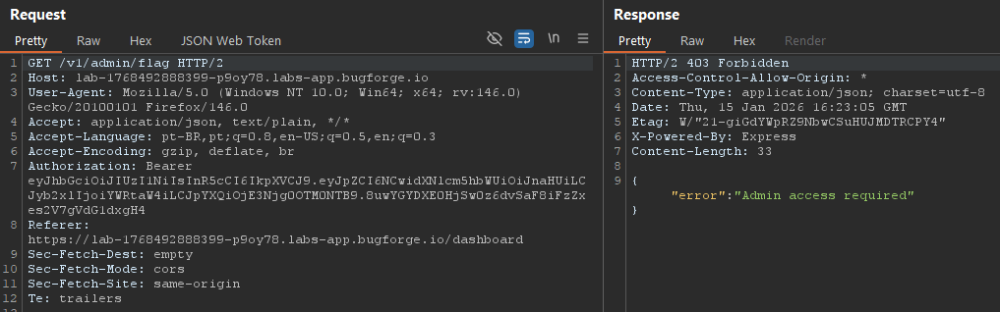
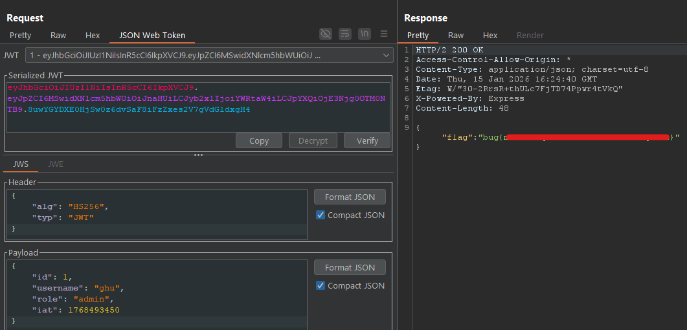

<div style="background: #161b22; border: 1px solid #30363d; border-left: 8px solid #238636; border-radius: 10px; padding: 20px; margin: 20px 0; font-family: monospace;">
<h2><b>daily challenge: 15/01/26</h2>
    <ul style="list-style: none; padding: 0; margin: 0; font-size: 1.2em; color: #8b949e;">
        <li>🟢 <b>difficulty:</b> <span style="color: #3fb950;">easy</span></li>
        <li>⚡ <b>xp earned:</b> <span style="color: #d29922;">10</span></li>
        <li>📂 <b>categories:</b> <code>api</code>
        <li>🛠️ <b>vulns:</b> <code>improper inventory management, no jwt validation</code>
    </ul>
</div>

## **0x00: recon**
- at first, we can login and register at the application, so, let's create our user

    

- it seems like a ranked typing game, with three different categories

    

- looking at the requests on burp, the first thing that grabs our attention is the `v2` on the endpoints, what make us believe there exists two versions of this api. when this occurs, if `v1` endpoints still acessible, its possible to reach some vulns.

    

## **0x01: our target = admin**
- ok, after play for a while with the application resources and try to find some bugs, we can go to debugger section on devtools and analyze the `.js` files.
- reviewing `static/js/components/AdminDashboard.js`, we can our goal endpoint: `/v2/admin/flag`

    

- obviously, this endpoint will put a `403 Forbidden` or our head, because the payload of our jwt is:
    ```json
    {
        "id": 4,
        "username": "ghu",
        "role": "user",
        "iat": 1768493450
    }
    ```
- we can test if the jwt validation is well implemented, and yes, it is.

    

- but if we change the endpoint to `/v1/admin/flag`?

    

- note that the message goes from `Invalid token` to `Admin access required`, what indicates that in the api v1, the jwt validation isn't well implemented, so, we just need change our id to `1` to take the flag!

    