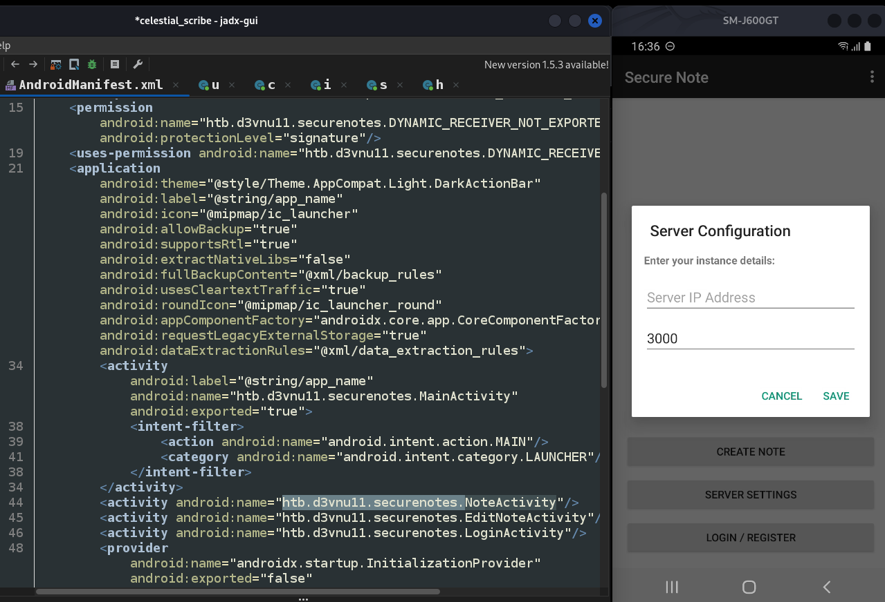
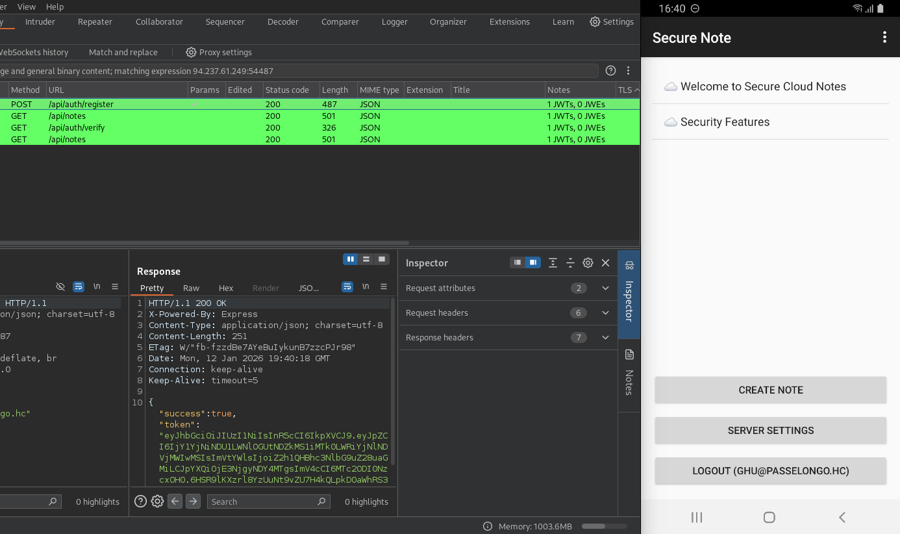
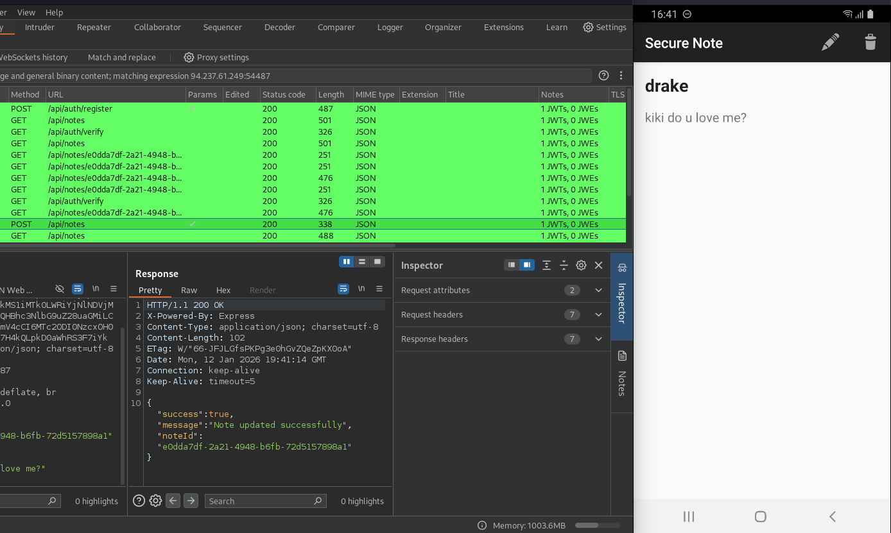
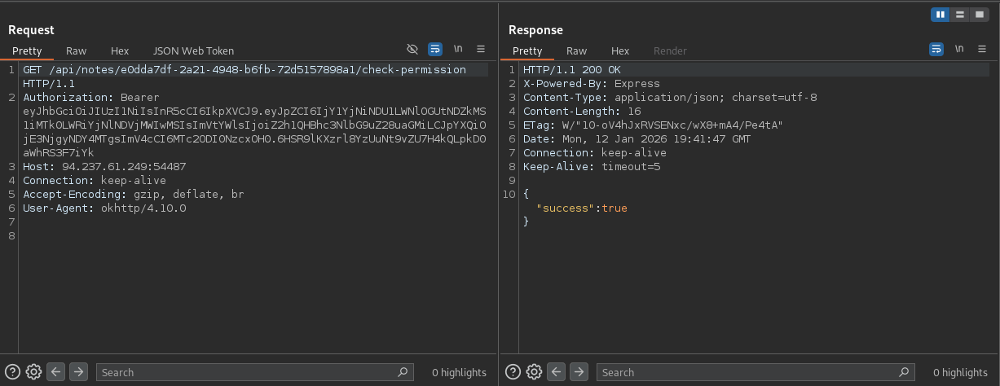
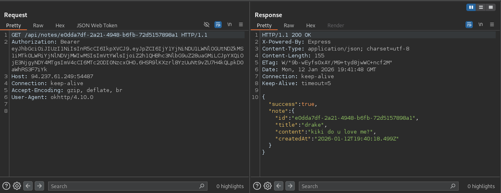

<h2><b>weekly challenge: 08/02/26 - 15/02/26</h2>
    <ul style="list-style: none; padding: 0; margin: 0; font-size: 1.2em; color: #8b949e;">
        <li>🟡 <b>difficulty:</b> medium</li>
        <li>⚡ <b>xp earned:</b> 30</li>
        <li>📂 <b>categories:</b> <code>mobile, api</code>
        <li>🛠️ <b>vulns:</b> <code>race condition</code>
    </ul>

## 0x01: recon
- at first, let's setup our environment: apk opened on `JADX`, physical mobile device screen mirrored to my computer with `scrcpy` (you can use an avd. i ocasionally use this physical phone for simple tests that involves only api and simple modifications)
    
- as we can see, there exists three activities: `MainActivity`, `NoteActivity`, `EditNoteActivity`. none of them are exported (`MainActivity` doesn't count)
- after register our user, we can login and acess `NoteActivity`. the `jwt` is locally stored at `localStorage`.
    
- at note creation, we can define if the note will be public or private, when public, a `POST` request is made to `/api/notes`, with the data passed in a `json`.
    
- when we click on a public note, this is the flow: at first, a request is made to `/api/notes/(guid)/check-permission`
    
- then, to grab the note content, a request is made to `/api/notes/(guid)`
    

## 0x02: fuzzing
- not only on these requests, but on all the requests made by the app, there is a `(bool)"sucess"` field on all responses. when we try to read a note that dont belong to us, obviously, `"sucess"` recieve the value false
- this kind of behaviour could lead us to attempt race condition, so, we will create a group with the two requests made on read-note flow. we will check our permission to read a note that belong to us and then try to read the content of an arbitrary note, like the one with id 1 (probably admin)
- grouping the requests and send in group (parallel, last-byte sync)
    