<div style="background: #161b22; border: 1px solid #30363d; border-left: 8px solid #238636; border-radius: 10px; padding: 20px; margin: 20px 0; font-family: monospace;">
<div style="text-align: center">
</img>
</div>
    <ul style="list-style: none; padding: 0; margin: 0; font-size: 1.2em; color: #8b949e;">
        <li>🔴 <b>difficulty:</b> <span style="color: #f30909;">hard</span></li>
        <li>⚡ <b>xp earned:</b> <span style="color: #d29922;">retired machine</span></li>
        <li>📂 <b>categories:</b> <code>active directory</code>
        <li>🛠️ <b>vulns:</b> <code>weak passwords, information disclousure, smb misconfiguration, cross-sesion relay, ESC1</code>
    </ul>
</div>

## 0x00: recon
- we can start enumerating the open ports using rustscan

    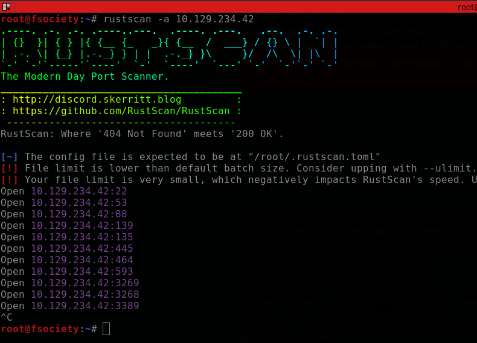

- the main services avaiable on this DC are:
    ```
    22/tcp      -> ssh
    53/tcp      -> dns
    88/tcp      -> kerberos
    139/445/tcp -> smb
    3389/tcp    -> rdp
    ```
- as we can see, no LDAP! this difficult our analysis but isn't that bad. we can test guest and null logins on smb and try to retrieve some information

    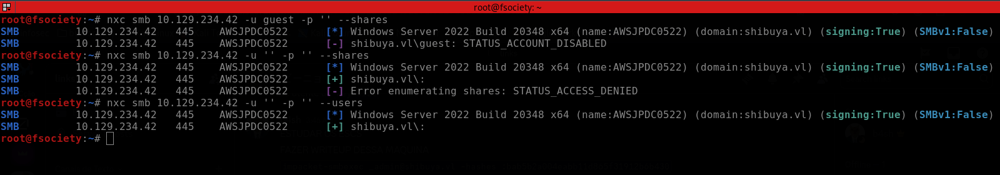

- ok, only null session got authenticated but we cannot retrieve valuable informations. now, we can try to bruteforce usernames via kerberos using `kerbrute`

    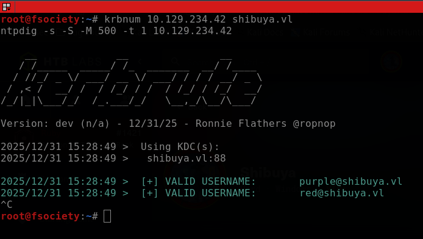

- nice, let's see if these two accounts have weak passwords with `crackmapexec` (this is common at the initial steps on a vulnlab machines)

    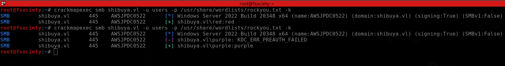

- ok, we finally get our frist credentials:
    ```
    [+] user:password

    [*] red:red
    [*] purple:purple
    ```
    
## 0x01: enumerating services
- with those credentials, we can now login at `smb` and enumerate users and shares, at frist.

    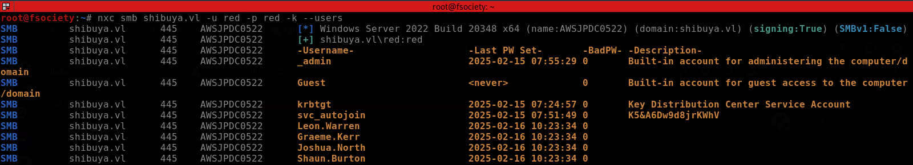

- using `netexec` passing the flag `--users`, we can perform a user enumeration, in addition, we gain another credentials!
    ```
    [+] user:password

    [*] red:red
    [*] purple:purple
    [*] svc_autojoin:K5&A6Dw9d8jrKWhV
    [*] Leon.Warren:
    [*] Graeme.Kerr:
    [*] Joshua.North:
    [*] Shaun.Burton:
    ```
- with `svc_autojoin` credentials, we got `READ` permisison on `images$` share, so, let's see access them.

    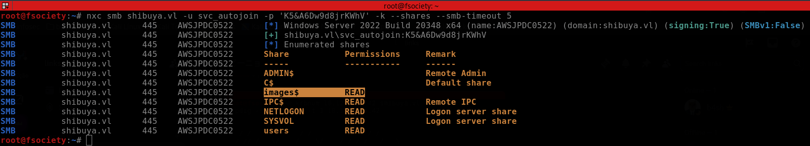

- there is some `.wim` files (windows imaging format), a way to store a windows machine filesystem in a unique file, facilitating installation and/or backup.

    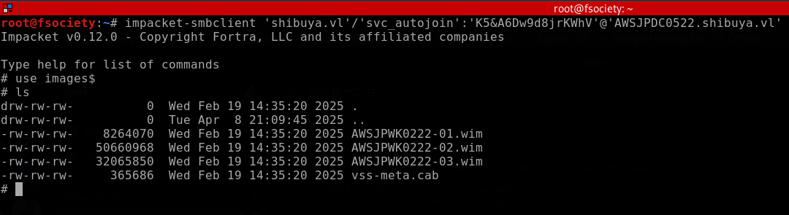

- to confirm if these files are really in windows imaging format and then extract, we can bring them to our machine, pass to `file` and then mount with `winmount`

    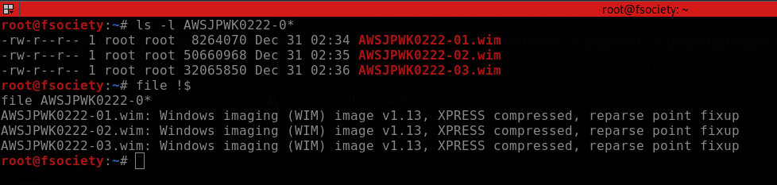

- mouting the `-02.wim`

    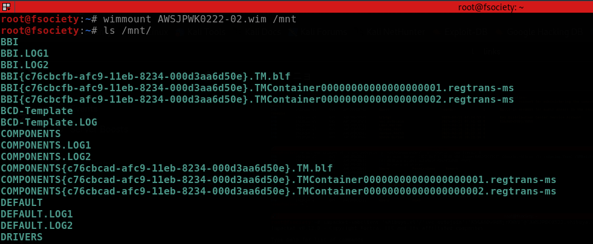

- as we can see, it seems like a backup from a `C:\Windows\System32\config` folder.

## 0x02: initial access
- knowing this, we may search for SYSTEM, SECURITY and SAM files, because on windows, these files stores password hashes (SAM & LSA secrets), check these [the hacker recipes](https://www.thehacker.recipes/ad/movement/credentials/dumping/sam-and-lsa-secrets) scheme:

    | **Hive** | **Details** | **Format or credential material** |
    | --- | --- | --- |
    | SAM | stores locally cached credentials (referred to as SAM secrets) | LM or NT hashes |
    | SECURITY | stores domain cached credentials (referred to as LSA secrets) | Plaintext passwords, LM or NT hashes, Kerberos keys (DES, AES), Domain Cached Credentials (DCC1 and DCC2), Security Questions (`L$*SQSA*<SID>`), |
    | SYSTEM | contains enough info to decrypt SAM secrets and LSA secrets | N/A |

- ok, with these files in hands, we can use `secretsdump` to extract the hashes.

    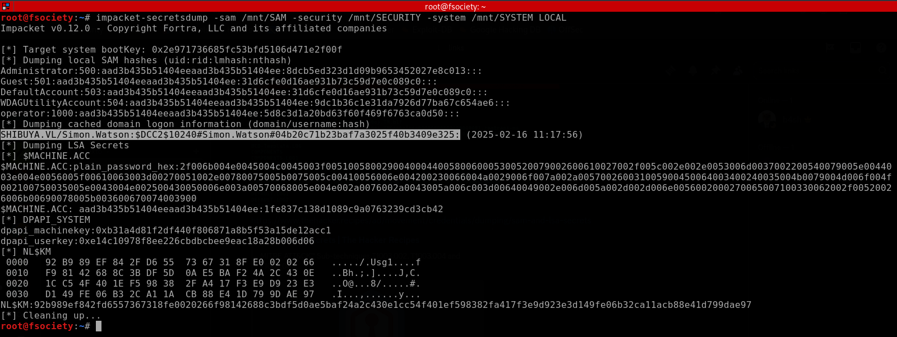

- there is some hashes and one of them appears to belong to `shibuya.vl\simon.watson` that do not authenticates. but, testing one of the another hashes, it works!

    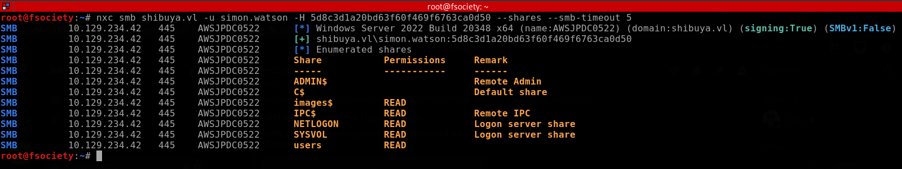

- now, we can go to `users\simon.watson` share (image of `C:\Users\Simon.Watson`), put a ssh public key and finally get the initial access.

    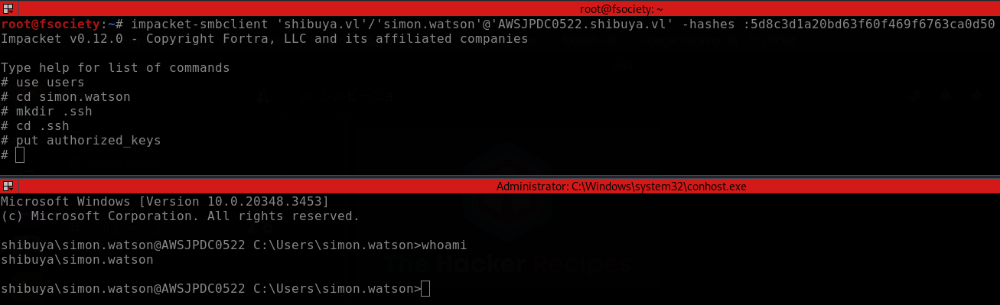

## 0x03: lateral movement
- after enumerating for a while and finding nothing, we can see if there exists some active user session. to do this we normally use [`qwinsta`](https://learn.microsoft.com/pt-br/windows-server/administration/windows-commands/qwinsta), but we aren't on a interactive session. so, we need to bring `RunasCs` to this machine and use they with logon type 9 (it's the same of using runas /netonly, where we allow a local process to run under one account but authenticate over the network as another, creating a distinct session for network resource access)

    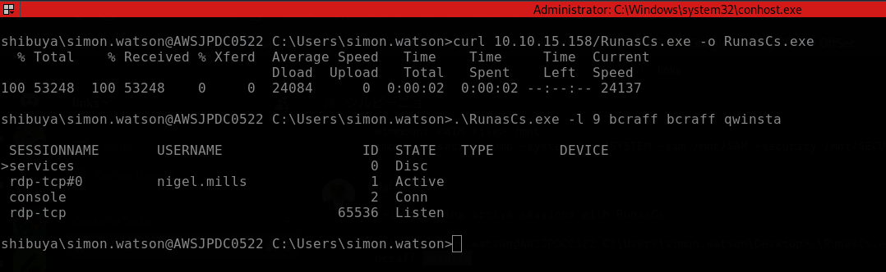

- as we can see, the user `nigel.mills` have a active session, so we can use [`RemotePotato0`](https://github.com/antonioCoco/RemotePotato0) to perform a [cross-session relay](https://www.safebreach.com/blog/remotepotato0-a-complex-active-directory-attack/) attack and grab your NTLM hash. as we are on a windows server 2016, we need to connect to our machine and then redirect the traffic using socat.

    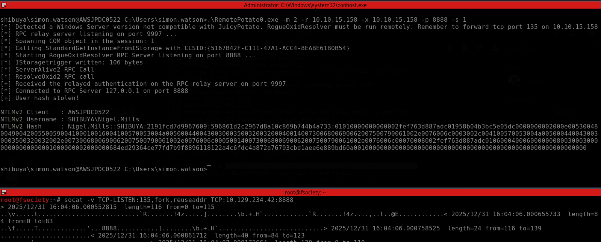

- cracking that hash, we obtain the nigel mills credentials, `nigel.mills:Sail2Boat3`.
- to gain a shell as nigel, we can use RunasCs or just repeat the ssh trick that we used to gain our first shell.

    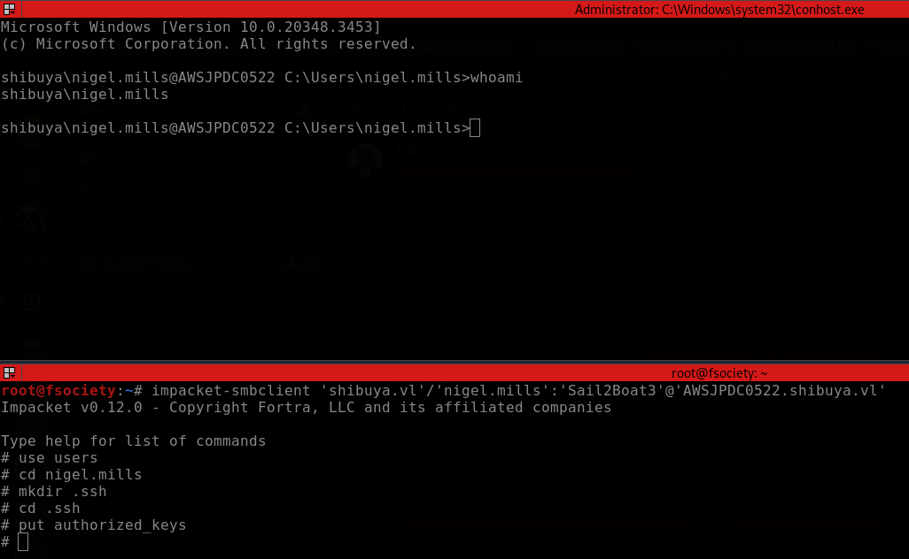

- enumerating our current user, we discover that he belongs to [`t1_admins`](https://techcommunity.microsoft.com/blog/coreinfrastructureandsecurityblog/protect-tier-1-sleep-well-at-night-/4418653) group, so, he probably can manage certificates from ADCS.

    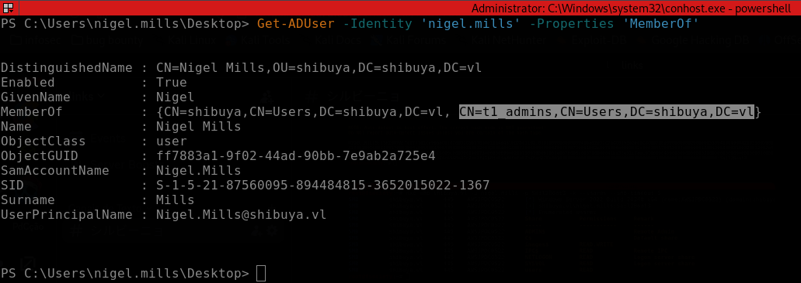

## 0x04: privesc
- checking if nigel.mills can enroll certificates

    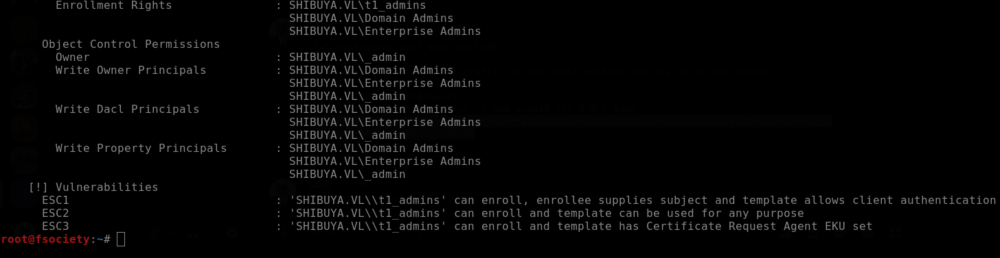

- gotcha! we just need to explore ESC1 and privesc to `_admin` (from enumeration, we discover that administrator was replaced with _admin)

    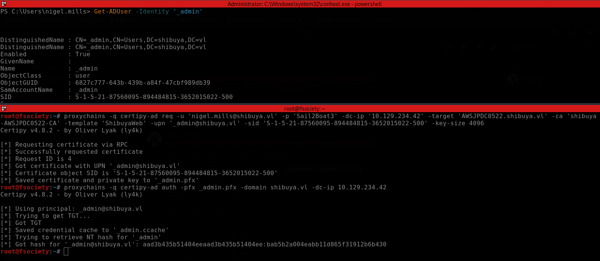
    
- all these exploitation was done with certipy via proxychains because the machine don't have LDAP